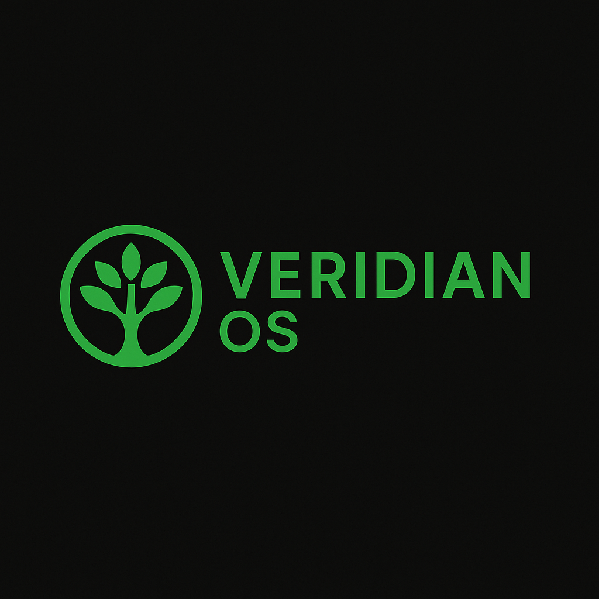

<!-- markdownlint-disable MD033 -->
# VeridianOS

<div align="center">


## A research microkernel operating system built with Rust

[](https://github.com/doublegate/VeridianOS/actions)
[](https://codecov.io/gh/doublegate/VeridianOS)
[](LICENSE-MIT)
[](LICENSE-APACHE)
[](https://discord.gg/24KbHS4C)

</div>

## Overview

**VeridianOS** is a research operating system written in Rust, focused on **correctness, isolation, and explicit architectural invariants**. It is intended as **executable documentation of high-assurance systems design**, not as a production OS or a general-purpose hobby kernel.

The project explores how capability-oriented design, strong isolation boundaries, and disciplined use of unsafe code can be combined to produce systems that are *auditable, teachable, and resilient to failure*. VeridianOS features a capability-based security model, zero-copy IPC, and multi-architecture support with an emphasis on reliability and deterministic behavior.

### Key Features

- 🛡️ **Capability-based security** — Unforgeable tokens for all resource access
- 🚀 **Microkernel architecture** — Minimal kernel with services in user space
- 🦀 **Written in Rust** — Memory safety without garbage collection
- ⚡ **High performance** — Lock-free algorithms, zero-copy IPC
- 🔧 **Multi-architecture** — x86_64, AArch64, and RISC-V support
- 🔒 **Security focused** — Mandatory access control, secure boot, hardware security
- 📦 **Modern package management** — Source and binary package support
- 🖥️ **Wayland compositor** — Modern display server with GPU acceleration

---

## Purpose

VeridianOS exists to explore and demonstrate:

- Capability-based system design with explicit authority boundaries
- Strong isolation between kernel, drivers, services, and userland
- Memory safety and ownership as architectural properties
- Deterministic, inspectable system behavior
- Long-horizon durability over short-term feature velocity

---

## Non-Goals

VeridianOS intentionally does **not** aim to be:

- A natively POSIX-based operating system (a POSIX compatibility layer is planned for future phases to support software porting, but native APIs remain capability-based)
- A Linux replacement or distribution
- A performance-first microbenchmark platform
- A feature-complete general-purpose OS

These exclusions are deliberate and protect architectural clarity. Where future compatibility layers are mentioned (e.g., POSIX, Wayland), they will be implemented as user-space libraries that translate to native capability-based interfaces, never as kernel-level compromises.

---

## Threat Model (Bounded)

VeridianOS assumes a single-machine environment with a trusted toolchain. It focuses on software isolation failures, authority misuse, and memory safety violations. Physical attacks, malicious firmware, and advanced side-channel attacks are out of scope by design.

---

## Core Architectural Invariants

The system is defined by explicit invariants governing authority, isolation, memory ownership, and unsafe code usage. These are normative and binding.

See [Invariants](docs/invariants.md) for the authoritative list.

---

## Architecture

VeridianOS uses a microkernel architecture with the following key components:

```
┌─────────────────────────────────────────────┐
│              User Applications              │
├─────────────────────────────────────────────┤
│    System Services (VFS, Network, etc.)     │
├─────────────────────────────────────────────┤
│    User-Space Drivers (Block, Network)      │
├─────────────────────────────────────────────┤
│    Microkernel (Memory, Scheduling, IPC)    │
└─────────────────────────────────────────────┘
```

---

## Repository Structure

```
kernel/        Trusted computing base
drivers/       Hardware interaction behind explicit privilege boundaries
services/      Capability-mediated system services
userland/      Intentionally constrained user processes
boot/          Bootloader and early initialization
docs/          Canonical specifications
experiments/   Non-normative exploratory work
```

---

## Project Status

**Latest Release**: v0.4.3 (February 15, 2026)

### Architecture Support

| Architecture | Build | Boot | Init Tests | Stage 6 | Stable Idle (30s) | Status |
|--------------|-------|------|-----------|---------|-------------------|--------|
| x86_64       | ✅    | ✅   | 27/27     | ✅      | ✅ PASS           | **100% Functional** -- UEFI boot via OVMF |
| AArch64      | ✅    | ✅   | 27/27     | ✅      | ✅ PASS           | **100% Functional** -- Direct kernel loading |
| RISC-V 64    | ✅    | ✅   | 27/27     | ✅      | ✅ PASS           | **100% Functional** -- OpenSBI boot |

### Development Phases

| Phase | Description | Status | Version | Date |
|-------|-------------|--------|---------|------|
| 0 | Foundation and Tooling | **Complete** | v0.1.0 | Jun 2025 |
| 1 | Microkernel Core | **Complete** | v0.2.1 | Jun 2025 |
| 2 | User Space Foundation | **Complete** | v0.3.2 | Feb 2026 |
| 3 | Security Hardening | **Complete** | v0.3.2 | Feb 2026 |
| 4 | Package Ecosystem | **Complete** | v0.4.0 | Feb 2026 |
| 5 | Performance Optimization | Planned | -- | -- |
| 6 | Advanced Features and GUI | Planned | -- | -- |

For detailed release notes, see [Release History](docs/RELEASE-HISTORY.md).

### What Is Built

Phases 0 through 4 are complete. The kernel provides:

- **IPC** -- Synchronous/asynchronous channels with zero-copy fast path (<1us)
- **Memory Management** -- Hybrid bitmap+buddy allocator, NUMA-aware, 4-level page tables
- **Process Management** -- Full lifecycle with context switching on all architectures
- **Scheduler** -- CFS with SMP support, load balancing, CPU affinity
- **Capability System** -- 64-bit unforgeable tokens, two-level O(1) lookup, revocation, interrupt capabilities
- **Interrupt Controllers** -- x86_64 APIC (Local + I/O), AArch64 GICv2, RISC-V PLIC with unified IRQ abstraction
- **VFS** -- ramfs, devfs, procfs, blockfs with POSIX-style file operations
- **Security** -- MAC, secure boot, TPM 2.0, ASLR, W^X, Spectre barriers, KPTI, post-quantum crypto
- **Package Manager** -- DPLL SAT resolver, ports system, reproducible builds, Ed25519 signing
- **Interactive Shell (vsh)** -- Bash/Fish-parity serial console shell with pipes, redirections, variable expansion, globbing, tab completion, job control, scripting (if/for/while/case), functions, aliases
- **Userland Bridge** -- Ring 0 to Ring 3 transitions with SYSCALL/SYSRET on x86_64

### What Comes Next

- **Phase 5: Performance Optimization** -- Sub-microsecond IPC, lock-free kernel paths, DPDK networking, NVMe optimization, profiling tools
- **Phase 6: Advanced Features** -- Wayland compositor, desktop environment, multimedia, virtualization, cloud-native features, POSIX compatibility layer

### Technical Notes

**AArch64 FP/NEON fix**: LLVM emits NEON/SIMD instructions (`movi v0.2d`, `str q0`) for buffer zeroing on buffers >= 16 bytes. Without CPACR_EL1.FPEN enabled, these instructions trap silently. Fixed by enabling FP/NEON in `boot.S` before entering Rust code.

**UnsafeBumpAllocator on AArch64**: AArch64 uses the same lock-free bump allocator as RISC-V, with a simple load-store allocation path (no CAS) and direct atomic initialization with DSB SY/ISB memory barriers.

**bare_lock::RwLock**: UnsafeCell-based single-threaded RwLock replacement for AArch64 bare metal, used in VFS filesystem modules to avoid `spin::RwLock` CAS spinlock hangs without proper exclusive monitor configuration.

**AArch64 LLVM workaround**: AArch64 bypasses a critical LLVM loop-compilation bug by routing `print!`/`println!` through `DirectUartWriter`, which uses `uart_write_bytes_asm()` -- a pure assembly loop that LLVM cannot miscompile. The `kprintln!` macro provides an alternative path using `direct_print_str()` for literal-only output. See [README - LLVM Bug](kernel/src/arch/aarch64/README_LLVM_BUG.md) for details.

### Maturity

VeridianOS is an active research system. Phases 0 through 4 are architecturally stable; Phase 5 (performance) and Phase 6 (advanced features) are next.

Historical status is recorded in:

- [`RELEASE-HISTORY.md`](docs/RELEASE-HISTORY.md) -- Detailed per-release notes
- [`PROJECT-STATUS.md`](docs/status/PROJECT-STATUS.md)
- [`PHASE2-STATUS-SUMMARY.md`](docs/status/PHASE2-STATUS-SUMMARY.md)
- [`BOOTLOADER-UPGRADE-STATUS.md`](docs/status/BOOTLOADER-UPGRADE-STATUS.md)

Normative truth lives in this README and `docs/`.

---

## Quick Start

### Prerequisites

- Rust nightly-2025-11-15 or later
- QEMU 8.0+ (for testing)
- 8GB RAM (16GB recommended)
- 20GB free disk space

### Building and Running

```bash
# Clone the repository
git clone https://github.com/doublegate/VeridianOS.git
cd VeridianOS

# Install dependencies (Ubuntu/Debian)
./scripts/install-deps.sh

# Build all architectures
./build-kernel.sh all dev      # Development build
./build-kernel.sh all release  # Release build

# Build a specific architecture
./build-kernel.sh x86_64 dev
./build-kernel.sh aarch64 release
./build-kernel.sh riscv64 dev

# Run in QEMU
just run

# Or build manually (x86_64 requires custom target)
cargo build --target targets/x86_64-veridian.json \
    -p veridian-kernel \
    -Zbuild-std=core,compiler_builtins,alloc

# Run in QEMU (x86_64 - requires UEFI disk image)
# First build the UEFI image:
./tools/build-bootimage.sh \
    target/x86_64-veridian/debug/veridian-kernel \
    target/x86_64-veridian/debug

# Then boot with OVMF firmware:
qemu-system-x86_64 \
    -bios /usr/share/edk2/x64/OVMF.4m.fd \
    -drive format=raw,file=target/x86_64-veridian/debug/veridian-uefi.img \
    -serial stdio \
    -display none

# Run in QEMU (AArch64)
qemu-system-aarch64 \
    -M virt \
    -cpu cortex-a57 \
    -kernel target/aarch64-unknown-none/debug/veridian-kernel \
    -serial stdio \
    -display none

# Run in QEMU (RISC-V)
qemu-system-riscv64 \
    -M virt \
    -kernel target/riscv64gc-unknown-none-elf/debug/veridian-kernel \
    -serial stdio \
    -display none
```

For detailed build instructions, see [BUILD-INSTRUCTIONS.md](docs/BUILD-INSTRUCTIONS.md).

---

## Supported Platforms

### Architectures

- **x86_64** — Full support (UEFI boot via bootloader 0.11.15)
- **AArch64** — Full support (direct QEMU `-kernel` loading)
- **RISC-V (RV64GC)** — Full support (direct QEMU `-kernel` loading via OpenSBI)

### Minimum Requirements

- 64-bit CPU with MMU
- 256MB RAM
- 1GB storage

### Recommended Requirements

- Multi-core CPU with virtualization support
- 4GB+ RAM
- NVMe storage

---

## Documentation

- 📖 [Architecture Overview](docs/ARCHITECTURE-OVERVIEW.md) — System design and architecture
- 🛠️ [Development Guide](docs/DEVELOPMENT-GUIDE.md) — Getting started with development
- 📚 [API Reference](docs/API-REFERENCE.md) — System call and library APIs
- 🧪 [Testing Strategy](docs/TESTING-STRATEGY.md) — Testing approach and guidelines
- 🔍 [Troubleshooting](docs/TROUBLESHOOTING.md) — Common issues and solutions

### Implementation Guides

- 🗺️ [Implementation Roadmap](docs/IMPLEMENTATION-ROADMAP.md) — Detailed development plan
- 🔄 [Software Porting Guide](docs/SOFTWARE-PORTING-GUIDE.md) — Porting Linux software to VeridianOS
- 🔧 [Compiler Toolchain Guide](docs/COMPILER-TOOLCHAIN-GUIDE.md) — Native compiler integration strategy
- 🚀 [Future Development Insights](docs/FUTURE-DEVELOPMENT-INSIGHTS.md) — Analysis and recommendations

### Development Phases

The project follows a phased development approach:

1. [Phase 0: Foundation](docs/00-PHASE-0-FOUNDATION.md) — Build system and tooling
2. [Phase 1: Microkernel Core](docs/01-PHASE-1-MICROKERNEL-CORE.md) — Core kernel functionality
3. [Phase 2: User Space Foundation](docs/02-PHASE-2-USER-SPACE-FOUNDATION.md) — Essential services
4. [Phase 3: Security Hardening](docs/03-PHASE-3-SECURITY-HARDENING.md) — Security features
5. [Phase 4: Package Ecosystem](docs/04-PHASE-4-PACKAGE-ECOSYSTEM.md) — Package management
6. [Phase 5: Performance Optimization](docs/05-PHASE-5-PERFORMANCE-OPTIMIZATION.md) — Performance tuning
7. [Phase 6: Advanced Features](docs/06-PHASE-6-ADVANCED-FEATURES.md) — GUI and advanced features

See [PROJECT-STATUS.md](docs/PROJECT-STATUS.md) for detailed status information and [Master TODO](to-dos/MASTER_TODO.md) for task tracking.

---

## How to Read the Code

1. [Invariants](docs/invariants.md) — Architectural invariants (start here)
2. [Architecture](docs/architecture.md) — System architecture

Helpful diagrams:
- [Mermaid - Architecture Capability Flow](docs/diagrams/architecture-capability-flow.mmd)
- [Mermaid - Kernal Entry Points](docs/diagrams/kernel-entry-points.mmd)

3. [Kernel Entry Points](docs/kernel-entry-points.md) — Kernel entry points
4. [Capability Flow](docs/capability-flow.md) — Capability flow into services and drivers

---

## Unsafe Code Policy

Unsafe Rust is permitted only to enforce higher-level invariants and is strictly controlled.

See [Unsafe Policy](docs/unsafe-policy.md).

---

## Performance Targets

VeridianOS is not a performance-first system, but targets reasonable latency for a research microkernel:

**Phase 1 targets** (achieved):

- IPC Latency: < 5μs
- Context Switch: < 10μs
- Microkernel Size: < 15,000 lines of code

**Phase 5 targets** (planned):

- IPC Latency: < 1μs
- Memory Allocation: < 1μs
- System Call Overhead: < 100ns
- Support for 1000+ concurrent processes

Design properties that support these targets include lock-free data structures in critical paths, zero-copy IPC, NUMA-aware memory allocation, and sub-microsecond system call paths.

---

## Security

Security is a fundamental design principle:

- **Capability-based access control** — Fine-grained, unforgeable permissions
- **Secure boot** — Full chain of trust verification
- **Memory safety** — Rust's ownership guarantees plus runtime checks
- **Mandatory access control** — SELinux-style policies
- **Hardware security** — TPM, HSM, and TEE integration

---

## Technical Roadmap

### Completed (2025-2026)

- [x] **Phase 0**: Foundation and Tooling (v0.1.0, Jun 2025)
- [x] **Phase 1**: Microkernel Core (v0.2.1, Jun 2025)
- [x] **Phase 2**: User Space Foundation (v0.3.2, Feb 2026)
- [x] **Phase 3**: Security Hardening (v0.3.2, Feb 2026)
- [x] **Phase 4**: Package Ecosystem and Self-Hosting (v0.4.0, Feb 2026)

### Upcoming

- [ ] **Phase 5**: Performance Optimization (5-6 months) -- Sub-microsecond IPC, lock-free kernel paths, DPDK networking, NVMe optimization
- [ ] **Phase 6**: Advanced Features (8-9 months) -- Wayland compositor, desktop environment, multimedia, virtualization, cloud-native, POSIX compatibility layer

See [Release History](docs/RELEASE-HISTORY.md) for detailed per-release notes.

---

## Contributing

Contributions are welcome. Please see the [Contributing Guide](CONTRIBUTING.md) for details on the code of conduct, development workflow, coding standards, and pull request process.

---

## Community

- [Discord Server](https://discord.gg/24KbHS4C) — Real-time chat
- [Issue Tracker](https://github.com/doublegate/VeridianOS/issues) — Bug reports and feature requests

---

## License

VeridianOS is dual-licensed under:

- MIT License ([LICENSE-MIT](LICENSE-MIT))
- Apache License, Version 2.0 ([LICENSE-APACHE](LICENSE-APACHE))

You may choose either license for your use.

---

## Acknowledgments

VeridianOS builds upon ideas from many excellent operating systems:

- **seL4** — Formal verification and capability systems
- **Redox OS** — Rust OS development practices
- **Fuchsia** — Component-based architecture
- **FreeBSD** — Driver framework inspiration
- **Linux** — Hardware support reference

---

<div align="center">




**Building the future of operating systems, one commit at a time.**

</div>
<!-- markdownlint-enable MD033 -->
