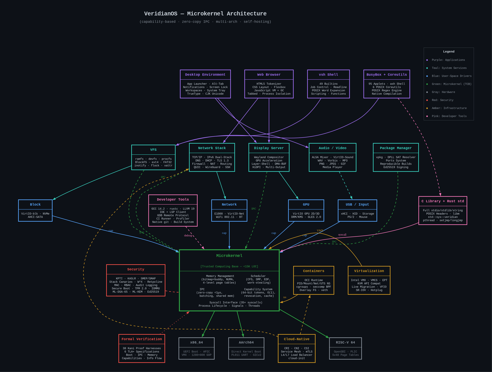
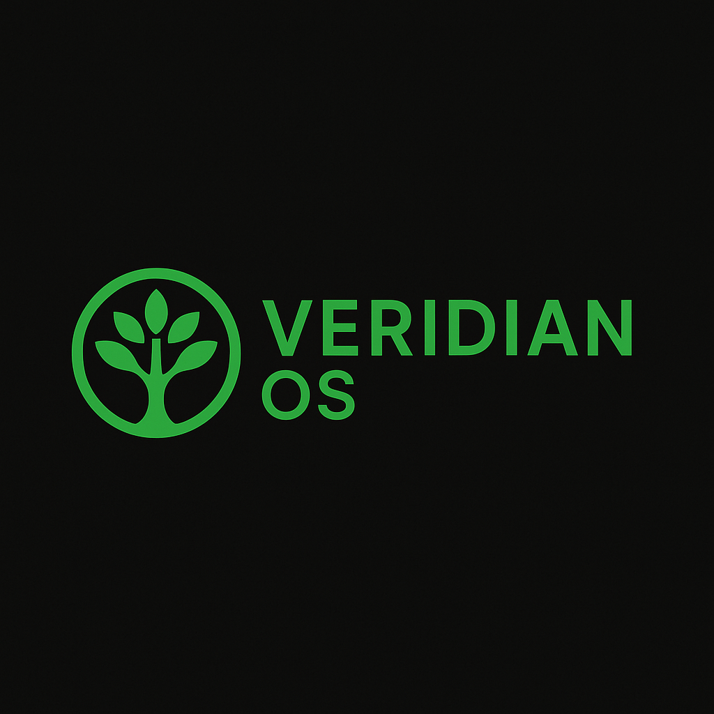

<!-- markdownlint-disable MD033 -->

# VeridianOS

<div align="center">


## A research microkernel operating system built with Rust

[](https://github.com/doublegate/VeridianOS/actions)
[](https://codecov.io/gh/doublegate/VeridianOS)
[](LICENSE-MIT)
[](LICENSE-APACHE)
[](https://discord.gg/24KbHS4C)

</div>

## Overview

**VeridianOS** is a research operating system written in Rust, focused on **correctness, isolation, and explicit architectural invariants**. It serves as **executable documentation of high-assurance systems design** -- exploring how capability-oriented architecture, strong isolation boundaries, and disciplined use of unsafe code produce systems that are _auditable, teachable, and resilient to failure_.

The system implements a capability-based security model, zero-copy IPC with sub-microsecond latency, and runs on three architectures (x86_64, AArch64, RISC-V). It is self-hosting, ships a Wayland desktop environment, supports containerized and virtualized workloads, and includes formal verification infrastructure -- all while keeping the microkernel under 15K lines of trusted code.

VeridianOS intentionally prioritizes architectural clarity over feature velocity. Native APIs are capability-based; compatibility layers (POSIX, Wayland) are implemented as user-space libraries that translate to native interfaces, never as kernel-level compromises.

---

## Key Features

### Core

- **Microkernel architecture** -- Minimal trusted computing base with all drivers and services in user space
- **Written in Rust** -- Memory safety without garbage collection; strict unsafe code policy
- **Capability-based security** -- 64-bit unforgeable tokens for all resource access with O(1) lookup, hierarchical delegation, and cascading revocation
- **Zero-copy IPC** -- Synchronous and asynchronous channels with register-based fast path (<1us for messages <=64 bytes)
- **Formal verification** -- 38 Kani proof harnesses and 6 TLA+ specifications covering boot chain, IPC, memory allocation, and capability invariants

### Platform

- **Multi-architecture** -- Full support for x86_64 (UEFI), AArch64, and RISC-V 64 (OpenSBI)
- **Self-hosting** -- Native GCC 14.2 and Rust compiler toolchain; BusyBox 1.36.1 with 95 applets compiled on-target
- **Package management** -- DPLL SAT dependency resolver, ports system, reproducible builds, Ed25519 package signing
- **Complete C library** -- Full stdio/stdlib/string/unistd with POSIX headers, math library, and architecture-specific setjmp/longjmp
- **Bash-compatible shell (vsh)** -- Pure Rust shell with 49 builtins, job control, readline, scripting, and POSIX word expansion

### Desktop & Multimedia

- **Wayland compositor** -- Wire protocol, SHM buffers, XDG shell, layer-shell, DMA-BUF, multi-output with HiDPI scaling
- **Desktop environment** -- Application launcher, Alt-Tab switcher, notifications, system tray, screen lock, virtual workspaces, TrueType fonts, CJK Unicode
- **GPU acceleration** -- VirtIO GPU 2D/3D, OpenGL ES 2.0, DRM/KMS, texture atlas compositor with shader pipeline; vendor stubs for i915, amdgpu, and nouveau
- **Audio & video** -- ALSA-compatible mixer, VirtIO-Sound, WAV/Vorbis/MP3 playback, PNG/JPEG/GIF/TGA/QOI decoders, media player
- **Web browser engine** -- HTML5 tokenizer, arena-based DOM, CSS layout (block/inline/float/flexbox), JavaScript VM with mark-sweep GC, tabbed browsing with process isolation

### Infrastructure

- **Networking** -- TCP/IP dual-stack (IPv4 + IPv6), zero-copy DMA, E1000 NIC driver, TCP Reno/Cubic/SACK, DNS, DHCP, VLAN, bonding, netfilter firewall with conntrack/NAT, RIP/OSPF routing, WiFi 802.11, Bluetooth L2CAP/RFCOMM, VPN tunnels, TLS 1.3, SSH, HTTP, QUIC, WireGuard, mDNS
- **Virtualization** -- Intel VMX hypervisor with VMCS/EPT, KVM API compatibility, QEMU device model with live migration, VFIO PCI passthrough, SR-IOV, CPU/memory/PCI hotplug
- **Containers** -- OCI runtime with PID/mount/network/UTS namespaces, cgroup memory+CPU, overlay filesystem, seccomp BPF, veth networking
- **Cloud-native** -- CRI/CNI/CSI interfaces, service mesh with mTLS and SPIFFE identity, L4/L7 load balancer, cloud-init metadata service
- **Enterprise** -- LDAP v3, Kerberos v5, NFS v4, SMB2/3, iSCSI initiator, software RAID 0/1/5

### Security

- **Defense in depth** -- KPTI shadow page tables, KASLR, stack canaries, SMEP/SMAP, retpoline, W^X enforcement, guard pages
- **Post-quantum cryptography** -- ML-DSA-65 (Dilithium) and ML-KEM (Kyber) alongside ChaCha20-Poly1305, Ed25519, X25519
- **Hardware security** -- TPM 2.0 integration, secure boot verification, IOMMU protection
- **Mandatory access control** -- Policy parser, RBAC, MLS enforcement, structured audit logging

### Developer Tools

- **Compiler toolchain** -- Cross and native GCC 14.2, Rust std platform port (`std::sys::veridian`), LLVM 19 bootstrap pipeline
- **Debugging** -- GDB remote serial protocol, kernel debug scripts, QEMU integration on all architectures
- **Development environment** -- IDE with gap buffer editor and LSP client, CI runner, profiler with flame graph rendering, native git client
- **Build system** -- Build orchestrator with dependency topological sort, package repository server

---

## Architecture

<div align="center">

</div>

All drivers and services run in user space with capability-controlled access to hardware. The microkernel provides only memory management, scheduling, IPC, and the capability system. See [Architecture Overview](docs/ARCHITECTURE-OVERVIEW.md) for detailed design documentation and [Invariants](docs/invariants.md) for the authoritative list of architectural invariants.

---

## Project Status

**Version**: v0.17.1 | **All development phases complete** | **68 releases published**

| Metric | Value |
| --- | --- |
| Build | 0 errors, 0 warnings across all 3 architectures |
| Boot tests | 29/29 (Stage 6 BOOTOK on all architectures) |
| Host-target unit tests | 4,095 passing |
| CI pipeline | 11/11 jobs green (GitHub Actions + Codecov) |
| Unsafe code | 7 justified `static mut` remaining (early boot, per-CPU, heap) |

### Architecture Support

| Architecture | Boot Method | Status |
| --- | --- | --- |
| x86_64 | UEFI via OVMF | 100% functional -- 1280x800 UEFI GOP, Ring 3 entry, native compilation |
| AArch64 | Direct kernel loading | 100% functional -- PL011 UART, signal frames, virtio-MMIO |
| RISC-V 64 | OpenSBI | 100% functional -- Sv48 page tables, full signal delivery |

### Performance (Achieved)

| Metric | Target | Achieved |
| --- | --- | --- |
| IPC latency | < 1us | < 1us (register-based fast path) |
| Context switch | < 10us | < 10us |
| Memory allocation | < 1us | < 500ns (slab allocator) |
| Capability lookup | O(1) | O(1) (two-level cache) |
| Concurrent processes | 1000+ | 1000+ |
| TLB shootdown | < 5us/CPU | 4.2us/CPU |

---

## Repository Structure

```text
kernel/        Trusted computing base (microkernel)
drivers/       Hardware interaction behind explicit privilege boundaries
services/      Capability-mediated system services (CRI, CNI, CSI, mesh, LB)
userland/      User processes, libc, libm, Rust std port, vsh, vpkg
boot/          Bootloader and early initialization
targets/       Rust target JSON specs (kernel and user-space, all 3 architectures)
scripts/       Build infrastructure (cross-toolchain, sysroot, rootfs)
toolchain/     CRT files, sysroot headers, CMake/Meson cross-compilation configs
ports/         Port definitions for external software (binutils, gcc, make, ninja)
verification/  Kani proofs and TLA+ specifications
docs/          Design documents and guides
```

---

## Quick Start

### Prerequisites

- Rust nightly-2025-11-15 or later
- QEMU 9.0+ (10.2+ recommended)
- 8GB RAM (16GB recommended)
- 20GB free disk space

### Building and Running

```bash
# Clone the repository
git clone https://github.com/doublegate/VeridianOS.git
cd VeridianOS

# Install dependencies (Ubuntu/Debian)
./scripts/install-deps.sh

# Build all architectures
./build-kernel.sh all dev      # Development build
./build-kernel.sh all release  # Release build

# Build a specific architecture
./build-kernel.sh x86_64 dev

# Run in QEMU (x86_64 - UEFI boot, requires OVMF)
qemu-system-x86_64 -enable-kvm \
    -drive if=pflash,format=raw,readonly=on,file=/usr/share/edk2/x64/OVMF.4m.fd \
    -drive id=disk0,if=none,format=raw,file=target/x86_64-veridian/debug/veridian-uefi.img \
    -device ide-hd,drive=disk0 \
    -serial stdio -display none -m 256M

# Run in QEMU (AArch64)
qemu-system-aarch64 -M virt -cpu cortex-a72 -m 256M \
    -kernel target/aarch64-unknown-none/debug/veridian-kernel \
    -serial stdio -display none

# Run in QEMU (RISC-V)
qemu-system-riscv64 -M virt -m 256M -bios default \
    -kernel target/riscv64gc-unknown-none-elf/debug/veridian-kernel \
    -serial stdio -display none

# Run tests
cargo test
```

#### Persistent Storage (BlockFS)

```bash
# Build cross-compiled BusyBox rootfs
./scripts/build-busybox-rootfs.sh all

# Create a 256MB persistent BlockFS image
./scripts/build-busybox-rootfs.sh blockfs

# Boot with persistent storage (needs 2GB RAM)
./scripts/run-veridian.sh --blockfs
```

For detailed build instructions, see [BUILD-INSTRUCTIONS.md](docs/BUILD-INSTRUCTIONS.md).

---

## Supported Platforms

| | x86_64 | AArch64 | RISC-V 64 |
| --- | --- | --- | --- |
| Boot | UEFI via OVMF | Direct `-kernel` | OpenSBI `-bios default` |
| Display | 1280x800 UEFI GOP | ramfb | ramfb |
| Minimum RAM | 256MB | 256MB | 256MB |
| Native compilation | 1.5GB+ | -- | -- |

**Minimum**: 64-bit CPU with MMU, 256MB RAM, 1GB storage.
**Recommended**: Multi-core CPU with virtualization support, 4GB+ RAM, NVMe storage.

---

## Documentation

- [Architecture Overview](docs/ARCHITECTURE-OVERVIEW.md) -- System design and layers
- [Development Guide](docs/DEVELOPMENT-GUIDE.md) -- Getting started with development
- [API Reference](docs/API-REFERENCE.md) -- System call and library APIs
- [Testing Strategy](docs/TESTING-STRATEGY.md) -- Testing approach and guidelines
- [Troubleshooting](docs/TROUBLESHOOTING.md) -- Common issues and solutions

### Design Documents

- [Capability System Design](docs/design/CAPABILITY-SYSTEM-DESIGN.md)
- [IPC Design](docs/design/IPC-DESIGN.md)
- [Memory Allocator Design](docs/design/MEMORY-ALLOCATOR-DESIGN.md)
- [Scheduler Design](docs/design/SCHEDULER-DESIGN.md)

### Guides

- [Software Porting Guide](docs/SOFTWARE-PORTING-GUIDE.md) -- Porting Linux software to VeridianOS
- [Compiler Toolchain Guide](docs/COMPILER-TOOLCHAIN-GUIDE.md) -- Native compiler integration
- [Rust Compiler Porting Guide](docs/RUST-COMPILER-PORTING.md) -- Porting rustc via LLVM 19
- [Persistent Storage Guide](docs/PERSISTENT-STORAGE.md) -- BlockFS filesystem and disk images
- [vsh Shell Guide](docs/VSH-SHELL-GUIDE.md) -- Bash-compatible shell usage and internals
- [Release History](docs/RELEASE-HISTORY.md) -- Detailed per-release notes

---

## How to Read the Code

1. [Invariants](docs/invariants.md) -- Architectural invariants (start here)
2. [Architecture](docs/architecture.md) -- System architecture
3. [Kernel Entry Points](docs/kernel-entry-points.md) -- Where execution begins
4. [Capability Flow](docs/capability-flow.md) -- How capabilities govern services and drivers

Helpful diagrams:

- [Architecture Capability Flow](docs/diagrams/architecture-capability-flow.mmd) (Mermaid)
- [Kernel Entry Points](docs/diagrams/kernel-entry-points.mmd) (Mermaid)

---

## Unsafe Code Policy

Unsafe Rust is permitted only to enforce higher-level invariants and is strictly controlled. Every unsafe block requires a `// SAFETY:` comment documenting the invariant it upholds. Coverage exceeds 100% (410 comments for 389 unsafe blocks).

See [Unsafe Policy](docs/unsafe-policy.md) for the full policy.

---

## Security

Security is a foundational design principle, not a bolt-on layer:

- **Capability-based access control** -- Fine-grained, unforgeable permissions for all resources
- **Memory safety** -- Rust ownership guarantees plus KPTI, KASLR, SMEP/SMAP, W^X, and guard pages
- **Post-quantum cryptography** -- ML-DSA-65, ML-KEM alongside classical algorithms
- **Mandatory access control** -- Policy-driven RBAC and MLS enforcement
- **Hardware security** -- TPM 2.0, secure boot chain, IOMMU isolation
- **Formal verification** -- Kani proofs for critical kernel invariants; TLA+ specifications for protocol correctness

---

## Contributing

Contributions are welcome. Please see the [Contributing Guide](CONTRIBUTING.md) for details on the code of conduct, development workflow, coding standards, and pull request process.

---

## Community

- [Discord Server](https://discord.gg/24KbHS4C) -- Real-time chat
- [Issue Tracker](https://github.com/doublegate/VeridianOS/issues) -- Bug reports and feature requests

---

## License

VeridianOS is dual-licensed under:

- MIT License ([LICENSE-MIT](LICENSE-MIT))
- Apache License, Version 2.0 ([LICENSE-APACHE](LICENSE-APACHE))

You may choose either license for your use.

---

## Acknowledgments

VeridianOS builds upon ideas from many excellent operating systems:

- **seL4** -- Formal verification and capability systems
- **Redox OS** -- Rust OS development practices
- **Fuchsia** -- Component-based architecture
- **FreeBSD** -- Driver framework inspiration
- **Linux** -- Hardware support reference

---

<div align="center">




**Building the future of operating systems, one commit at a time.**

</div>
<!-- markdownlint-enable MD033 -->
