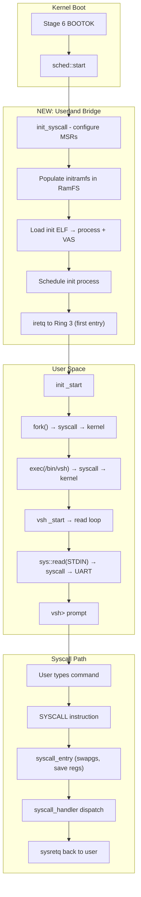
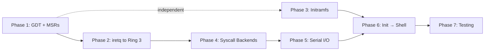

# Userland Bridge: Kernel → Shell Planning Document

**Date:** 2026-02-15
**Version:** 0.3.5 → target 0.4.0
**Goal:** Boot to an interactive `vsh>` prompt over serial in QEMU (x86_64 first, then AArch64/RISC-V)

---

## Executive Summary

VeridianOS boots to Stage 6 BOOTOK with 22/22 init tests passing. The kernel creates process control blocks for init and shell during bootstrap, but **never actually transitions to Ring 3**. All the pieces exist in isolation — ELF loader, syscall entry/exit, process creation, userland binaries — but they are not connected end-to-end.

This document plans the 7 work items needed to bridge the kernel scheduler idle loop to a working `vsh>` shell prompt.

---

## Current State Audit

### What EXISTS and WORKS

| Component | Location | Status |
|-----------|----------|--------|
| ELF64 parser | `kernel/src/elf/mod.rs` | ✅ Parses headers, segments, relocations |
| ELF → VAS loader | `kernel/src/elf/mod.rs` (`load()`) | ✅ Maps LOAD segments into VAS with correct flags |
| User program loader | `kernel/src/userspace/loader.rs` | ✅ Reads ELF from VFS, creates ProcessCreateOptions |
| Process creation | `kernel/src/process/creation.rs` | ✅ Creates PCB, allocates PID, registers in table |
| Syscall handler | `kernel/src/syscall/mod.rs` | ✅ Dispatch table, rate limiter, audit logging |
| SYSCALL/SYSRET entry | `kernel/src/arch/x86_64/syscall.rs` | ✅ Naked asm, swapgs, register save/restore, sysretq |
| Syscall numbers | `kernel/src/syscall/mod.rs` | ✅ exit, fork, read, write, open, close, wait, exec, getpid, sleep + IPC |
| libveridian syscall wrappers | `userland/libs/libveridian/src/sys.rs` | ✅ Inline asm for x86_64, AArch64, RISC-V |
| Init process | `userland/init/src/main.rs` | ✅ fork→exec("/bin/vsh"), monitor loop |
| Shell (vsh) | `userland/shell/src/main.rs` | ✅ Readline, builtins (help, echo, ls, ps, uptime, exit) |
| RamFS | `kernel/src/fs/ramfs.rs` | ✅ In-memory filesystem, mounted as root |
| GDT + TSS | `kernel/src/arch/x86_64/gdt.rs` | ✅ Kernel CS/DS, TSS with Ring 0 stack |
| Page fault handler | `kernel/src/mm/page_fault.rs` | ✅ Handles user-mode faults, stack growth |
| User pointer validation | `kernel/src/syscall/userspace.rs` | ✅ Range checks, page mapping validation |

### What is MISSING or INCOMPLETE

| Gap | Description | Blocks |
|-----|-------------|--------|
| **No user-mode GDT segments** | GDT has kernel CS/DS and TSS, but no Ring 3 code/data segments | Ring 3 transition |
| **`init_syscall()` never called** | `kernel/src/arch/x86_64/syscall.rs::init_syscall()` exists but is `#[allow(dead_code)]` — EFER/LSTAR/STAR MSRs never configured | All syscalls |
| **No per-CPU GS base** | `syscall_entry` does `swapgs` + `mov gs:[0x0]`/`gs:[0x8]` but per-CPU data struct doesn't exist | Syscall entry |
| **ThreadContext.init() ignores Ring 3** | Sets RIP/RSP but no CS/SS/RFLAGS for user mode; TODO comments reference TSS | Ring 3 iretq/sysretq |
| **No `iretq` to user mode** | No function to push SS/RSP/RFLAGS/CS/RIP and `iretq` for first entry to user mode | First process start |
| **TSS kernel stack is static** | Single static 20KB stack, not per-process | Context switch to user process |
| **No initramfs / embedded binaries** | `load_init_process()` tries VFS paths (`/sbin/init`, `/bin/init`), but nothing is placed there | Init loading |
| **Scheduler doesn't dispatch user processes** | `sched::start()` runs idle loop; created PCBs sit in process table but never get scheduled for Ring 3 execution | Everything |
| **No serial I/O syscall backend** | `SYS_READ`/`SYS_WRITE` handlers exist but aren't connected to UART for fd 0/1/2 | Shell I/O |
| **Userland binaries not cross-compiled** | `userland/` workspace exists but no build integration to produce ELF binaries with correct target triple | Init/shell loading |

---

## Architecture Overview



---

## Implementation Plan

### Phase 1: GDT + SYSCALL MSR Setup

**Goal:** Configure the CPU so Ring 3 transitions are mechanically possible.

**Files to modify:**
- `kernel/src/arch/x86_64/gdt.rs`
- `kernel/src/bootstrap.rs`
- `kernel/src/arch/x86_64/syscall.rs`

**Tasks:**

1. **Add user-mode segments to GDT**
   - Add `Descriptor::user_code_segment()` at selector `0x18` (Ring 3 CS)
   - Add `Descriptor::user_data_segment()` at selector `0x20` (Ring 3 SS)
   - Verify selector values match `Star::write()` in `init_syscall()`
   - The `x86_64` crate's `GlobalDescriptorTable` supports these via `Descriptor::user_code_segment()` and `Descriptor::user_data_segment()`

2. **Call `init_syscall()` during boot**
   - Add call in `bootstrap.rs` Stage 5 or early Stage 6 (after GDT init, before process creation)
   - Remove `#[allow(dead_code)]` from `init_syscall()`
   - This configures EFER (enable SYSCALL), LSTAR (entry point), STAR (segment selectors)

3. **Create per-CPU data structure for `swapgs`**
   - `syscall_entry` reads kernel RSP from `gs:[0x0]` and saves user RSP to `gs:[0x8]`
   - Create a `#[repr(C)]` struct: `{ kernel_rsp: u64, user_rsp: u64 }`
   - Write its address to `KernelGsBase` MSR during init
   - On context switch, update `kernel_rsp` to the current process's kernel stack top

**Exit Criteria:** `init_syscall()` runs without fault. GDT has 5 entries (null, kernel CS, kernel DS, user CS, user DS, TSS).

**Estimated Complexity:** Medium — mostly wiring existing code.

---

### Phase 2: First User-Mode Entry (`iretq`)

**Goal:** Successfully execute a single instruction in Ring 3.

**Files to modify:**
- `kernel/src/arch/x86_64/context.rs`
- `kernel/src/sched/` (scheduler dispatch)
- New: `kernel/src/arch/x86_64/usermode.rs`

**Tasks:**

1. **Implement `enter_usermode()` function**
   ```
   Push to stack: User SS, User RSP, RFLAGS (with IF set), User CS, User RIP
   Execute: iretq
   ```
   - This is the *first* entry to user mode for a new process
   - Subsequent returns use `sysretq` (already implemented in `syscall_entry`)

2. **Update `ThreadContext::init()` for user-mode processes**
   - Set `cs` to user code selector (Ring 3)
   - Set `ss` to user data selector (Ring 3)
   - Set `rflags` with `IF` (interrupt flag) set
   - Store kernel stack pointer for TSS/per-CPU data

3. **Per-process kernel stacks**
   - Currently: single static 20KB kernel stack in TSS
   - Need: allocate a kernel stack per process (e.g., 16KB from heap)
   - On context switch to a user process, update `TSS.privilege_stack_table[0]` to that process's kernel stack
   - This is where the CPU switches on SYSCALL/interrupt from Ring 3

4. **Scheduler integration**
   - When the scheduler picks a user-mode process for the first time, call `enter_usermode()` instead of the normal context switch
   - Add a `first_run: bool` flag to the process/thread state, or check if the context has been initialized for user mode

**Exit Criteria:** A test process that executes `SYS_EXIT` in Ring 3 exits cleanly back to kernel.

**Estimated Complexity:** High — this is the most architecturally sensitive phase. `iretq` stack frame must be exact.

---

### Phase 3: Initramfs and Binary Loading

**Goal:** Init and shell ELF binaries are available in the VFS at boot.

**Files to modify:**
- `kernel/src/bootstrap.rs`
- `kernel/src/fs/` (ramfs population)
- `userland/` build system
- `Cargo.toml` / `build-kernel.sh` / `Justfile`

**Tasks:**

1. **Cross-compile userland binaries**
   - Create a custom target JSON for userland (or use `x86_64-unknown-none` with appropriate linker script)
   - Build `userland/init` and `userland/shell` as freestanding ELF binaries
   - They already use `#![no_std]` + `#![no_main]` + custom `_start`
   - Need: linker script setting `.text` base at a user-space address (e.g., `0x400000`)
   - Need: link against `libveridian` for syscall wrappers

2. **Embed binaries into kernel image**
   - Option A (simplest): `include_bytes!()` in kernel source
     ```rust
     static INIT_ELF: &[u8] = include_bytes!("../../../userland/target/.../init");
     static SHELL_ELF: &[u8] = include_bytes!("../../../userland/target/.../vsh");
     ```
   - Option B: Build a CPIO initramfs archive appended to kernel image
   - **Recommend Option A** for initial bring-up — minimal infrastructure needed

3. **Populate RamFS at boot**
   - After RamFS is mounted as root (already happens in bootstrap)
   - Create `/sbin/init` and `/bin/vsh` in RamFS with embedded ELF contents
   - `load_init_process()` already searches these paths — it will find them

4. **Add `just build-userland` target**
   - Build userland workspace with correct target triple
   - Strip binaries (`llvm-strip` or `rust-lld --strip-all`)
   - Integrate into `just build` / `just run` pipeline

**Exit Criteria:** `load_init_process()` successfully parses the embedded init ELF. `load_shell()` finds `/bin/vsh`.

**Estimated Complexity:** Medium — build system plumbing, but no architectural risk.

---

### Phase 4: Syscall Backend Wiring

**Goal:** `SYS_READ`, `SYS_WRITE`, `SYS_EXIT`, `SYS_FORK`, `SYS_EXEC`, `SYS_WAIT`, `SYS_GETPID` all work from user mode.

**Files to modify:**
- `kernel/src/syscall/mod.rs` (dispatch)
- `kernel/src/syscall/process.rs`
- `kernel/src/syscall/filesystem.rs`
- `kernel/src/process/lifecycle.rs`

**Tasks:**

1. **SYS_EXIT (0)** — Terminate calling process, return status to parent
   - Already partially implemented; needs to remove from scheduler, wake parent if waiting

2. **SYS_GETPID (8)** — Return current PID
   - Trivial; `current_process().pid`

3. **SYS_WRITE (3)** — Write to fd
   - For fd 1 (stdout) and fd 2 (stderr): write directly to serial UART
   - Validate user pointer, copy to kernel buffer, call `serial::write_bytes()`
   - This is the minimum needed for `println!()` from user space

4. **SYS_READ (2)** — Read from fd
   - For fd 0 (stdin): read from serial UART
   - Blocking read: if no byte available, block the process in scheduler, wake on UART interrupt
   - This is what `vsh` uses for its readline loop

5. **SYS_FORK (1)** — Clone current process
   - Duplicate VAS (copy-on-write ideal, but deep copy acceptable for bring-up)
   - Clone file descriptor table
   - Create new PCB with copied ThreadContext
   - Return 0 to child, child PID to parent

6. **SYS_EXEC (7)** — Replace process image
   - Load ELF from path argument (validated from user pointer)
   - Replace current process's VAS with new one
   - Reset ThreadContext to new entry point
   - Set up fresh user stack with argv/envp

7. **SYS_WAIT (6)** — Wait for child exit
   - Block parent until child exits
   - Return (child_pid, exit_status)

8. **SYS_SLEEP (9)** — Sleep for N milliseconds
   - Add process to scheduler sleep queue with timer

**Exit Criteria:** A user-mode process can `write("hello\n")` to serial and `exit(0)`.

**Estimated Complexity:** High — fork and exec are the two hardest syscalls in any OS.

---

### Phase 5: Serial I/O for Shell

**Goal:** `vsh` can read keystrokes and write output over QEMU serial.

**Files to modify:**
- `kernel/src/serial.rs` (or `kernel/src/drivers/serial/`)
- `kernel/src/syscall/filesystem.rs`
- Interrupt handler for UART RX

**Tasks:**

1. **UART TX (output)**
   - `SYS_WRITE` for fd 1/2 → write bytes to serial port `0x3F8`
   - Already have `serial::write_byte()` in the kernel; just call it from syscall handler

2. **UART RX (input) with interrupt-driven buffering**
   - Configure UART to generate IRQ4 on receive
   - ISR reads byte from `0x3F8`, pushes to ring buffer
   - `SYS_READ` for fd 0:
     - If buffer has data → copy to user buffer, return count
     - If buffer empty → block process, add to "waiting for serial input" queue
     - UART ISR wakes blocked process when new data arrives

3. **Line discipline (optional for v1)**
   - Echo typed characters back (UART RX → UART TX)
   - Handle backspace, Ctrl+C (SIGINT equivalent)
   - Can defer to vsh itself (it already handles backspace in `read_line()`)

4. **File descriptor table**
   - Each process needs fd 0/1/2 pre-opened pointing to serial console
   - Set up during process creation for init; inherited by children via fork

**Exit Criteria:** Type a character in QEMU terminal → see it echoed by vsh → vsh processes command → output appears.

**Estimated Complexity:** Medium — UART TX is trivial, RX with blocking is moderate.

---

### Phase 6: Init → Shell Chain

**Goal:** Kernel boots → init runs → init forks/execs vsh → `vsh>` prompt appears.

**Files to modify:**
- Integration of Phases 1-5
- Possibly `userland/init/src/main.rs` (simplify for bring-up)

**Tasks:**

1. **Simplified init for bring-up**
   - Consider a minimal init that skips `fork()` and directly `exec("/bin/vsh")`
   - Or even simpler: kernel loads vsh directly as PID 1 (skip init entirely for first boot)
   - Once working, switch back to proper init → fork → exec chain

2. **Process inheritance**
   - Init's fd 0/1/2 (serial console) must be inherited by vsh after fork+exec
   - VAS must be properly set up for vsh after exec replaces init's child image

3. **Signal handling stub**
   - Init's `monitor_loop()` calls `sys::wait()` — needs SYS_WAIT working
   - If shell exits, init restarts it — needs fork+exec working in a loop

**Exit Criteria:** `just run` → kernel boots → `vsh>` prompt appears in terminal → `help` command works.

**Estimated Complexity:** Low if Phases 1-5 are solid — this is mostly integration.

---

### Phase 7: Testing Strategy

**Goal:** Automated CI verification that the kernel boots to a shell prompt.

**Tasks:**

1. **QEMU integration test**
   ```bash
   # Boot kernel, wait for "vsh>" on serial, send "help\n", verify output, send "exit\n"
   timeout 30 qemu-system-x86_64 \
       -enable-kvm -m 2G -smp 1 \
       -serial stdio -display none \
       -kernel target/.../veridian_kernel \
       | tee /tmp/boot.log &
   
   # Wait for prompt, interact, check output
   expect -c '
       spawn ...
       expect "vsh>"
       send "help\r"
       expect "Available commands"
       send "exit\r"
       expect "exited with status 0"
   '
   ```

2. **Unit tests for each phase**
   - Phase 1: Test GDT segment selectors are correct values
   - Phase 2: Test `iretq` frame construction
   - Phase 3: Test embedded ELF is valid (parse headers in unit test)
   - Phase 4: Test each syscall handler with mock process context
   - Phase 5: Test UART ring buffer

3. **Regression gate**
   - Existing 22/22 init tests must continue passing
   - Add boot-to-shell test to CI (GitHub Actions)
   - Test all three architectures (x86_64 first, then AArch64 `eret`, RISC-V `sret`)

**Exit Criteria:** CI runs boot-to-shell test on every PR.

---

## Dependency Graph



**Critical path:** Phase 1 → Phase 2 → Phase 4 → Phase 5 → Phase 6

**Parallel work:** Phase 3 (initramfs/build system) can proceed alongside Phases 1-2.

---

## Risk Register

| Risk | Likelihood | Impact | Mitigation |
|------|-----------|--------|------------|
| GDT selector mismatch causes #GP on sysretq | Medium | High (triple fault) | Verify selectors match between GDT init and STAR MSR; test with single-step in GDB |
| Per-CPU GS base not set → swapgs reads garbage | High | High (immediate crash) | Implement and test per-CPU data before any user-mode transition |
| Fork COW too complex for initial bring-up | Medium | Medium (delays) | Start with deep copy (clone all pages), optimize to COW later |
| Userland linker script puts .text at wrong address | Medium | Medium | Use `objdump -h` to verify section addresses; test with minimal "exit immediately" binary first |
| UART RX interrupt not firing in QEMU | Low | Medium | Test interrupt setup independently; fall back to polling if needed |
| Stack overflow in kernel during syscall | Medium | High | Per-process 16KB kernel stacks; test with deep syscall chains |
| Existing 22/22 tests break | Low | High | Run existing test suite after each phase; gate on green CI |

---

## Recommended Implementation Order

1. **Phase 3** (build system — can start immediately, no kernel changes)
2. **Phase 1** (GDT + MSRs — foundational, small scope)
3. **Phase 2** (Ring 3 entry — hardest part, test with minimal "syscall exit" binary)
4. **Phase 4** (syscalls — start with EXIT + WRITE, then READ, then FORK/EXEC)
5. **Phase 5** (serial I/O — connect UART to read/write syscalls)
6. **Phase 6** (integration — wire everything together)
7. **Phase 7** (CI testing — automate what you've been testing manually)

**Milestone checkpoints:**
- ✅ After Phase 2: "Hello from Ring 3!" printed via SYS_WRITE
- ✅ After Phase 5: Minimal shell binary reads input and echoes it
- ✅ After Phase 6: Full `vsh>` prompt with builtins working

---

## Architecture-Specific Notes

### x86_64 (primary target)
- Ring 3 via `iretq` (first entry) / `sysretq` (subsequent returns)
- SYSCALL/SYSRET via MSRs (EFER, LSTAR, STAR)
- `swapgs` for per-CPU kernel stack pointer
- TSS `privilege_stack_table[0]` for Ring 0 stack on interrupt/syscall

### AArch64 (follow-on)
- EL0 via `eret` (already in `kernel/src/arch/aarch64/context.rs`)
- System calls via `svc #0`
- TTBR0_EL1 for user page tables, TTBR1_EL1 for kernel
- SP_EL0/SP_EL1 split already exists

### RISC-V 64 (follow-on)
- U-mode via `sret` (already in `kernel/src/arch/riscv/context.rs`)
- System calls via `ecall`
- `sscratch` for kernel stack pointer swap
- Note: bump allocator limitation means careful memory management

---

## Files Index

Key files that will be modified, grouped by phase:

```
Phase 1:
  kernel/src/arch/x86_64/gdt.rs          # Add user segments
  kernel/src/arch/x86_64/syscall.rs      # Call init_syscall()
  kernel/src/bootstrap.rs                 # Wire init_syscall() into boot

Phase 2:
  kernel/src/arch/x86_64/context.rs      # User-mode ThreadContext
  kernel/src/arch/x86_64/usermode.rs     # NEW: enter_usermode() via iretq
  kernel/src/sched/                       # Dispatch user processes

Phase 3:
  userland/                               # Build system, linker scripts
  kernel/src/bootstrap.rs                 # Embed + populate RamFS
  Justfile                                # build-userland target

Phase 4:
  kernel/src/syscall/mod.rs              # Wire dispatch
  kernel/src/syscall/process.rs          # fork, exec, wait, exit
  kernel/src/syscall/filesystem.rs       # read, write (serial backend)

Phase 5:
  kernel/src/serial.rs                   # UART RX interrupt + ring buffer
  kernel/src/syscall/filesystem.rs       # Blocking read for fd 0

Phase 6:
  Integration testing, minimal fixups

Phase 7:
  .github/workflows/                     # CI boot-to-shell test
  scripts/test-boot-to-shell.sh          # NEW: expect-based test
```
