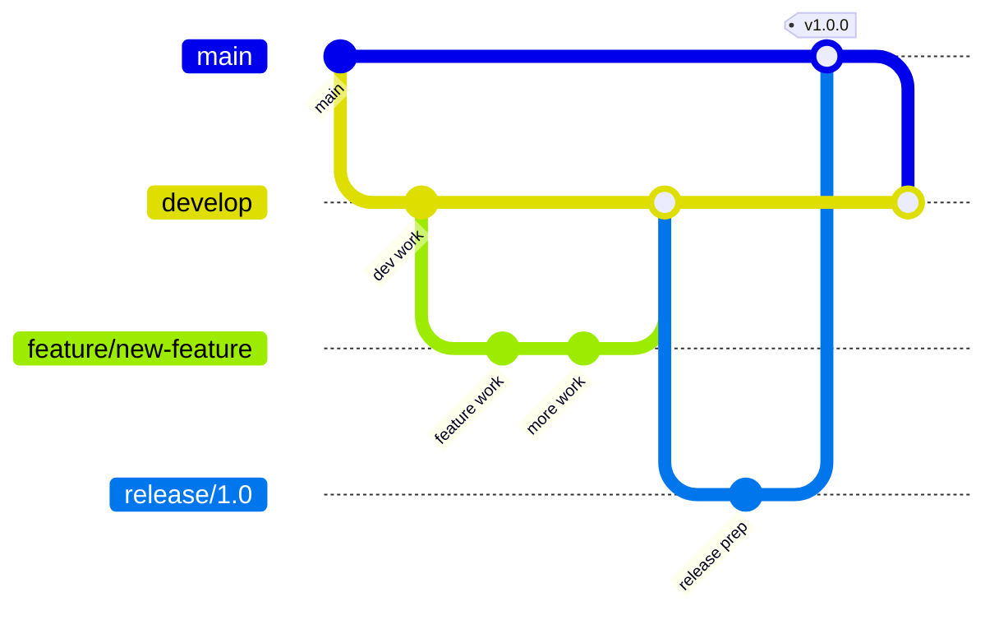

# Contributing to Veridian OS

Welcome to the Veridian OS project! We’re excited that you’re interested in contributing to the next generation of operating systems. This guide will help you get started with contributing to Veridian OS.

## Table of Contents

1. [Code of Conduct](#code-of-conduct)
1. [Getting Started](#getting-started)
1. [Development Process](#development-process)
1. [Code Style Guidelines](#code-style-guidelines)
1. [Commit Guidelines](#commit-guidelines)
1. [Pull Request Process](#pull-request-process)
1. [Testing Requirements](#testing-requirements)
1. [Documentation Standards](#documentation-standards)
1. [Architecture Decisions](#architecture-decisions)
1. [Community](#community)

## Code of Conduct

### Our Pledge

We as members, contributors, and leaders pledge to make participation in our community a harassment-free experience for everyone, regardless of age, body size, visible or invisible disability, ethnicity, sex characteristics, gender identity and expression, level of experience, education, socio-economic status, nationality, personal appearance, race, caste, color, religion, or sexual identity and orientation.

### Standards

**Positive behaviors include:**

- Using welcoming and inclusive language
- Being respectful of differing viewpoints and experiences
- Gracefully accepting constructive criticism
- Focusing on what is best for the community
- Showing empathy towards other community members

**Unacceptable behaviors include:**

- The use of sexualized language or imagery
- Trolling, insulting/derogatory comments, and personal attacks
- Public or private harassment
- Publishing others’ private information without permission
- Other conduct which could reasonably be considered inappropriate

### Enforcement

Instances of abusive, harassing, or otherwise unacceptable behavior may be reported to the community leaders responsible for enforcement at conduct@veridian-os.org. All complaints will be reviewed and investigated promptly and fairly.

## Getting Started

### Prerequisites

Before contributing, ensure you have:

1. **Rust Knowledge**: Familiarity with Rust programming language
1. **OS Concepts**: Basic understanding of operating system concepts
1. **Git Proficiency**: Experience with Git version control
1. **Development Environment**: See our [Development Guide](./development-guide.md)

### Setting Up Your Development Environment

```bash
# Clone the repository
git clone https://github.com/veridian-os/veridian.git
cd veridian

# Install Rust toolchain
rustup toolchain install nightly-2025-01-15
rustup default nightly-2025-01-15
rustup component add rust-src rustfmt clippy

# Install required tools
cargo install just
cargo install cargo-nextest
cargo install cargo-watch

# Build the project
just build

# Run tests
just test
```

### Understanding the Codebase

```
veridian/
├── kernel/           # Microkernel implementation
│   ├── src/         # Kernel source code
│   ├── arch/        # Architecture-specific code
│   └── tests/       # Kernel tests
├── libs/            # Core libraries
│   ├── libveridian/ # Core system library
│   └── libcap/      # Capability library
├── drivers/         # Device drivers
├── services/        # System services
├── userland/        # User-space applications
├── tools/           # Development tools
└── docs/            # Documentation
```

## Development Process

### Issue Tracking

1. **Check Existing Issues**: Before starting work, check if an issue already exists
1. **Create an Issue**: If not, create a new issue describing the problem/feature
1. **Get Assigned**: Wait for maintainer assignment or approval before starting major work
1. **Update Progress**: Keep the issue updated with your progress

### Branching Strategy



- `main`: Stable release branch
- `develop`: Integration branch for features
- `feature/*`: Feature development branches
- `fix/*`: Bug fix branches
- `release/*`: Release preparation branches

### Workflow

1. **Fork** the repository
1. **Create** a feature branch from `develop`
1. **Commit** your changes
1. **Test** thoroughly
1. **Push** to your fork
1. **Submit** a pull request to `develop`

## Code Style Guidelines

### Rust Style

We follow the standard Rust style guide with some project-specific additions:

```rust
// File header template
//! # Module Name
//! 
//! Brief description of the module's purpose.
//! 
//! ## Examples
//! 
//! ```rust
//! use veridian::example;
//! 
//! let result = example::function();
//! ```

use core::fmt;

/// Constants should be SCREAMING_SNAKE_CASE
const MAX_BUFFER_SIZE: usize = 4096;

/// Type definitions should be documented
/// 
/// This structure represents...
#[derive(Debug, Clone)]
pub struct Example {
    /// Field documentation
    field: u32,
}

impl Example {
    /// Constructor documentation
    /// 
    /// # Arguments
    /// 
    /// * `value` - Initial value for the field
    /// 
    /// # Returns
    /// 
    /// A new instance of `Example`
    pub fn new(value: u32) -> Self {
        Self { field: value }
    }
    
    /// Method documentation with examples
    /// 
    /// # Examples
    /// 
    /// ```rust
    /// let example = Example::new(42);
    /// assert_eq!(example.process(), 84);
    /// ```
    pub fn process(&self) -> u32 {
        self.field * 2
    }
}

// Tests should be in a separate module
#[cfg(test)]
mod tests {
    use super::*;
    
    #[test]
    fn test_example_creation() {
        let example = Example::new(42);
        assert_eq!(example.field, 42);
    }
}
```

### Safety Comments

All `unsafe` blocks must have safety comments:

```rust
// SAFETY: We have exclusive access to this memory region
// and the pointer is valid for the entire lifetime of the operation.
unsafe {
    ptr::write(address, value);
}
```

### Error Handling

Use the type system for error handling:

```rust
#[derive(Debug, thiserror::Error)]
pub enum ExampleError {
    #[error("Invalid input: {0}")]
    InvalidInput(String),
    
    #[error("Operation failed")]
    OperationFailed(#[from] io::Error),
}

pub type Result<T> = core::result::Result<T, ExampleError>;
```

## Commit Guidelines

### Commit Message Format

We follow the Conventional Commits specification:

```
<type>(<scope>): <subject>

<body>

<footer>
```

#### Types

- `feat`: New feature
- `fix`: Bug fix
- `docs`: Documentation changes
- `style`: Code style changes (formatting, etc.)
- `refactor`: Code refactoring
- `perf`: Performance improvements
- `test`: Test additions or corrections
- `build`: Build system changes
- `ci`: CI configuration changes
- `chore`: Other changes that don’t modify src or test files

#### Examples

```
feat(kernel): add capability-based IPC mechanism

Implement a new IPC mechanism based on capabilities that provides
better security isolation between processes. This replaces the
previous message-passing system.

Closes #123
```

```
fix(memory): prevent use-after-free in frame allocator

The frame allocator could previously return the same frame twice
under certain race conditions. This fix adds proper synchronization
to prevent this issue.

Fixes #456
```

### Commit Best Practices

1. **Atomic Commits**: Each commit should represent one logical change
1. **Compile-Ready**: Each commit should compile and pass tests
1. **Clear Messages**: Write clear, descriptive commit messages
1. **Sign Commits**: Use `git commit -s` to sign commits

## Pull Request Process

### Before Submitting

- [ ] Code follows the style guidelines
- [ ] Self-review of code performed
- [ ] Comments added for complex logic
- [ ] Documentation updated if needed
- [ ] Tests added/updated
- [ ] All tests pass locally
- [ ] Commit messages follow guidelines
- [ ] Branch is up-to-date with `develop`

### PR Template

```markdown
## Description
Brief description of changes

## Type of Change
- [ ] Bug fix
- [ ] New feature
- [ ] Breaking change
- [ ] Documentation update

## Testing
- [ ] Unit tests pass
- [ ] Integration tests pass
- [ ] Manual testing performed

## Checklist
- [ ] My code follows the project style
- [ ] I have performed self-review
- [ ] I have added tests
- [ ] I have updated documentation
- [ ] My changes generate no warnings

## Related Issues
Closes #(issue number)
```

### Review Process

1. **Automated Checks**: CI must pass
1. **Code Review**: At least 2 approvals required
1. **Testing**: Reviewers may request additional tests
1. **Documentation**: Ensure docs are updated
1. **Merge**: Maintainer merges after approval

### Review Etiquette

**For Authors:**

- Respond to feedback constructively
- Make requested changes promptly
- Explain your reasoning when disagreeing
- Thank reviewers for their time

**For Reviewers:**

- Be constructive and specific
- Suggest improvements, don’t just criticize
- Approve promptly when satisfied
- Use “Request changes” sparingly

## Testing Requirements

### Test Categories

1. **Unit Tests**: Test individual components
1. **Integration Tests**: Test component interactions
1. **System Tests**: Test full system behavior
1. **Performance Tests**: Ensure performance targets
1. **Security Tests**: Validate security properties

### Writing Tests

```rust
#[cfg(test)]
mod tests {
    use super::*;
    
    // Unit test example
    #[test]
    fn test_component_behavior() {
        let component = Component::new();
        assert_eq!(component.operation(), expected_value);
    }
    
    // Property-based test example
    #[test]
    fn test_property() {
        proptest!(|(input: u32)| {
            let result = function(input);
            prop_assert!(result.is_valid());
        });
    }
    
    // Async test example
    #[tokio::test]
    async fn test_async_operation() {
        let result = async_function().await;
        assert!(result.is_ok());
    }
}
```

### Test Coverage

- Aim for >80% code coverage
- Critical paths require >95% coverage
- Use `cargo tarpaulin` for coverage reports
- Add tests for all new features
- Add regression tests for bug fixes

## Documentation Standards

### Code Documentation

Every public API must be documented:

```rust
/// Allocates a new frame from the frame allocator.
/// 
/// This function attempts to allocate a single 4KiB frame from
/// the system frame allocator. It uses a buddy allocation strategy
/// for efficient memory management.
/// 
/// # Returns
/// 
/// - `Some(Frame)` if allocation succeeds
/// - `None` if no frames are available
/// 
/// # Example
/// 
/// ```rust
/// let frame = allocate_frame();
/// if let Some(f) = frame {
///     // Use the frame
///     unsafe { zero_frame(f); }
/// }
/// ```
/// 
/// # Panics
/// 
/// This function will panic if the frame allocator is not initialized.
pub fn allocate_frame() -> Option<Frame> {
    FRAME_ALLOCATOR.lock().allocate()
}
```

### Documentation Types

1. **API Documentation**: Rustdoc for all public APIs
1. **Architecture Docs**: High-level design documents
1. **User Guides**: End-user documentation
1. **Developer Guides**: Contributing and development guides
1. **Tutorials**: Step-by-step learning materials

### Writing Good Documentation

- Use clear, simple language
- Include examples for complex concepts
- Keep documentation up-to-date with code
- Use diagrams where helpful
- Cross-reference related documentation

## Architecture Decisions

### ADR (Architecture Decision Record) Process

Major architectural decisions require an ADR:

```markdown
# ADR-001: Use Capability-Based Security Model

## Status
Accepted

## Context
We need a security model that provides fine-grained access control
while maintaining performance and simplicity.

## Decision
We will use a capability-based security model where all resource
access is mediated through unforgeable capability tokens.

## Consequences
**Positive:**
- Fine-grained access control
- No ambient authority
- Composable security policies

**Negative:**
- More complex than traditional models
- Requires careful capability management
- Learning curve for developers

## Alternatives Considered
1. Traditional Unix permissions
2. SELinux-style MAC
3. Windows-style ACLs
```

### When to Create an ADR

- Major architectural changes
- Security model decisions
- API design choices
- Technology selections
- Performance trade-offs

## Community

### Communication Channels

- **Discord**: [discord.gg/veridian-os](https://discord.gg/veridian-os) - Real-time chat
- **Forums**: [forum.veridian-os.org](https://forum.veridian-os.org) - Long-form discussions
- **Mailing List**: dev@veridian-os.org - Development discussions
- **Blog**: [blog.veridian-os.org](https://blog.veridian-os.org) - Project updates

### Getting Help

1. **Documentation**: Check the docs first
1. **Discord #help**: Ask in the help channel
1. **Stack Overflow**: Tag with `veridian-os`
1. **Issue Tracker**: For bugs and features

### Recognition

We value all contributions:

- **Contributors Page**: Listed in CONTRIBUTORS.md
- **Release Notes**: Credited in release notes
- **Blog Posts**: Featured contributor stories
- **Swag**: T-shirts and stickers for significant contributions

## First-Time Contributors

### Good First Issues

Look for issues labeled `good-first-issue`:

```bash
# Find good first issues
gh issue list --label "good-first-issue"
```

### Mentorship

We offer mentorship for new contributors:

1. Find a mentor in Discord #mentorship
1. Pair programming sessions available
1. Code review feedback
1. Architecture walkthroughs

### Learning Resources

- [Rust Book](https://doc.rust-lang.org/book/)
- [OS Dev Wiki](https://wiki.osdev.org/)
- [Veridian Architecture Guide](./architecture.md)
- [Video Tutorials](https://youtube.com/veridian-os)

## Thank You!

Thank you for contributing to Veridian OS! Your efforts help build a more secure, reliable, and performant operating system for everyone. We look forward to your contributions and are here to help you succeed.

If you have any questions, don’t hesitate to reach out through our community channels. Welcome to the Veridian OS family! 🎉