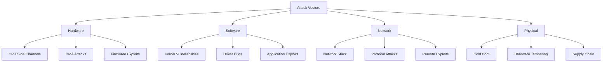
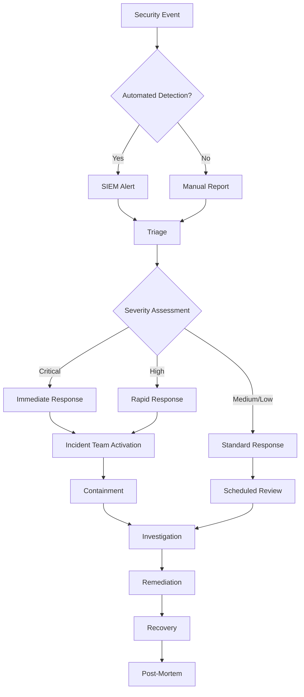

# Veridian OS Security Architecture and Threat Model

## Table of Contents

1. [Security Philosophy](#security-philosophy)
1. [Threat Model](#threat-model)
1. [Security Architecture](#security-architecture)
1. [Security Boundaries](#security-boundaries)
1. [Cryptographic Infrastructure](#cryptographic-infrastructure)
1. [Memory Safety](#memory-safety)
1. [Supply Chain Security](#supply-chain-security)
1. [Incident Response](#incident-response)
1. [Security Roadmap](#security-roadmap)

## Security Philosophy

### Core Principles

1. **Defense in Depth**: Multiple layers of security controls
1. **Least Privilege**: Minimal permissions by default
1. **Zero Trust**: Verify everything, trust nothing
1. **Secure by Default**: Security enabled out-of-the-box
1. **Transparency**: Open source for verifiability

### Design Goals

- Eliminate entire classes of vulnerabilities through Rust’s type system
- Minimize attack surface through microkernel architecture
- Enable secure multi-tenancy for cloud deployments
- Support confidential computing workloads
- Provide post-quantum cryptographic readiness

## Threat Model

### Threat Actors

#### External Threats

1. **Nation-State Actors**
- Capabilities: Advanced persistent threats, zero-days
- Mitigations: Formal verification, secure boot, attestation
1. **Cybercriminals**
- Capabilities: Ransomware, cryptojacking
- Mitigations: Capability-based security, sandboxing
1. **Script Kiddies**
- Capabilities: Known exploits, automated tools
- Mitigations: Regular updates, secure defaults

#### Internal Threats

1. **Malicious Insiders**
- Capabilities: Privileged access abuse
- Mitigations: Audit logging, least privilege
1. **Compromised Accounts**
- Capabilities: Lateral movement
- Mitigations: Capability isolation, MFA

### Attack Vectors



### Risk Assessment Matrix

|Threat              |Likelihood|Impact  |Risk Level|Mitigation Priority|
|--------------------|----------|--------|----------|-------------------|
|Memory Corruption   |Low (Rust)|Critical|Medium    |High               |
|Side Channels       |Medium    |High    |High      |Critical           |
|Supply Chain        |Medium    |Critical|High      |Critical           |
|Privilege Escalation|Low       |High    |Medium    |High               |
|Data Exfiltration   |Medium    |High    |High      |Critical           |

## Security Architecture

### Layered Security Model

```
┌─────────────────────────────────────────────────────────┐
│                 User Applications                       │
│          (Sandboxed, Capability-limited)               │
├─────────────────────────────────────────────────────────┤
│                 System Services                         │
│        (Privileged, Audited, Isolated)                 │
├─────────────────────────────────────────────────────────┤
│                 Security Monitor                        │
│    (MAC, Audit, Crypto, Policy Enforcement)            │
├─────────────────────────────────────────────────────────┤
│                  Microkernel                           │
│      (Minimal TCB, Formally Verified Core)             │
├─────────────────────────────────────────────────────────┤
│              Hardware Security                          │
│  (Secure Boot, TPM, HSM, TrustZone/SGX/SEV)          │
└─────────────────────────────────────────────────────────┘
```

### Capability-Based Security

```rust
/// Capability definition with security properties
pub struct Capability {
    /// Unique identifier
    id: CapabilityId,
    /// Referenced kernel object
    object: KernelObject,
    /// Permission bits
    rights: CapabilityRights,
    /// Unforgeable badge for identification
    badge: u64,
    /// Generation counter for temporal safety
    generation: u64,
    /// Audit trail
    provenance: CapabilityProvenance,
}

bitflags! {
    pub struct CapabilityRights: u64 {
        // Basic rights
        const READ          = 0x0000_0001;
        const WRITE         = 0x0000_0002;
        const EXECUTE       = 0x0000_0004;
        const DELETE        = 0x0000_0008;
        
        // Capability management
        const DUPLICATE     = 0x0000_0010;
        const TRANSFER      = 0x0000_0020;
        const RESTRICT      = 0x0000_0040;
        const GRANT         = 0x0000_0080;
        
        // Special rights
        const PRIVILEGED    = 0x0000_0100;
        const AUDIT_EXEMPT  = 0x0000_0200;
        const BYPASS_MAC    = 0x0000_0400;
    }
}
```

### Mandatory Access Control (MAC)

```rust
pub struct SecurityContext {
    /// User identity
    user: UserId,
    /// Role assignments
    roles: HashSet<RoleId>,
    /// Security clearance level
    clearance: SecurityLevel,
    /// Compartments/Categories
    categories: BitSet,
    /// Integrity level
    integrity: IntegrityLevel,
}

pub enum SecurityPolicy {
    /// Bell-LaPadula for confidentiality
    BellLaPadula {
        no_read_up: bool,
        no_write_down: bool,
    },
    /// Biba for integrity
    Biba {
        no_read_down: bool,
        no_write_up: bool,
    },
    /// Domain Type Enforcement
    DTE {
        domain_rules: HashMap<DomainId, DomainRules>,
    },
    /// Custom policy engine
    Custom(Box<dyn PolicyEngine>),
}
```

## Security Boundaries

### Process Isolation

1. **Address Space Isolation**
- Hardware-enforced memory protection
- ASLR with high entropy
- Guard pages between mappings
- W^X enforcement
1. **Capability Isolation**
- No ambient authority
- Explicit capability passing
- Revocation support
- Delegation tracking
1. **Resource Isolation**
- CPU quota enforcement
- Memory limits
- I/O bandwidth control
- Network segmentation

### Driver Isolation

```rust
pub struct DriverSandbox {
    /// Memory regions accessible to driver
    memory_access: MemoryAccessPolicy,
    /// I/O ports and MMIO regions
    io_permissions: IoPermissions,
    /// Interrupt routing
    interrupt_policy: InterruptPolicy,
    /// DMA restrictions
    dma_policy: DmaPolicy,
}

impl DriverSandbox {
    pub fn verify_access(&self, addr: PhysAddr) -> Result<(), SecurityError> {
        if !self.memory_access.is_allowed(addr) {
            audit_log!(SecurityEvent::UnauthorizedAccess {
                driver: current_driver_id(),
                address: addr,
                action: "memory_access"
            });
            return Err(SecurityError::AccessDenied);
        }
        Ok(())
    }
}
```

## Cryptographic Infrastructure

### Algorithm Selection

|Purpose             |Primary    |Backup           |Quantum-Safe|
|--------------------|-----------|-----------------|------------|
|Symmetric Encryption|AES-256-GCM|ChaCha20-Poly1305|AES-256     |
|Hashing             |SHA-3-256  |BLAKE3           |SHA-3-512   |
|Digital Signatures  |Ed25519    |ECDSA-P256       |ML-DSA-65   |
|Key Exchange        |X25519     |ECDH-P256        |ML-KEM-768  |
|KDF                 |Argon2id   |PBKDF2           |Argon2id    |

### Key Management

```rust
pub struct KeyManager {
    /// Hardware security module interface
    hsm: Option<HsmInterface>,
    /// Trusted Platform Module
    tpm: Option<TpmInterface>,
    /// Software key store (encrypted)
    software_store: EncryptedKeyStore,
    /// Key derivation hierarchy
    kdf_tree: KdfTree,
}

pub struct KeyLifecycle {
    /// Key generation parameters
    generation: KeyGenParams,
    /// Validity period
    validity: ValidityPeriod,
    /// Rotation schedule
    rotation: RotationPolicy,
    /// Destruction requirements
    destruction: DestructionPolicy,
}
```

### Secure Random Number Generation

```rust
pub struct CryptoRng {
    /// Hardware RNG if available
    hw_rng: Option<HardwareRng>,
    /// Software CSPRNG
    sw_rng: ChaCha20Rng,
    /// Entropy pool
    entropy_pool: EntropyPool,
}

impl CryptoRng {
    pub fn generate_secure_bytes(&mut self, len: usize) -> Vec<u8> {
        // Mix hardware and software sources
        let mut bytes = vec![0u8; len];
        
        if let Some(ref mut hw) = self.hw_rng {
            hw.fill_bytes(&mut bytes);
        }
        
        // XOR with software RNG for defense in depth
        let mut sw_bytes = vec![0u8; len];
        self.sw_rng.fill_bytes(&mut sw_bytes);
        
        for i in 0..len {
            bytes[i] ^= sw_bytes[i];
        }
        
        // Update entropy pool
        self.entropy_pool.mix_in(&bytes);
        
        bytes
    }
}
```

## Memory Safety

### Hardware Memory Tagging

```rust
pub struct MemoryTagManager {
    /// Tag size in bits (4 for MTE, 6 for LAM)
    tag_bits: u8,
    /// Granule size for tagging
    granule_size: usize,
    /// Tag generation strategy
    tag_strategy: TagStrategy,
}

pub enum TagStrategy {
    /// Random tags for each allocation
    Random,
    /// Sequential tags with overflow
    Sequential,
    /// Type-based tagging
    TypeBased(TypeTagMap),
    /// Custom strategy
    Custom(Box<dyn TagGenerator>),
}

impl MemoryTagManager {
    pub unsafe fn tag_memory_region(
        &self,
        ptr: *mut u8,
        size: usize,
        tag: u8
    ) -> Result<TaggedPointer, TagError> {
        let aligned_size = align_up(size, self.granule_size);
        
        for offset in (0..aligned_size).step_by(self.granule_size) {
            self.set_memory_tag(ptr.add(offset), tag)?;
        }
        
        Ok(TaggedPointer {
            ptr: self.apply_pointer_tag(ptr, tag),
            size,
            tag,
        })
    }
}
```

### Stack Protection

```rust
pub struct StackProtection {
    /// Stack canaries
    canary: StackCanary,
    /// Shadow stacks for ROP protection
    shadow_stack: Option<ShadowStack>,
    /// Stack isolation between threads
    isolation: StackIsolation,
}

impl StackProtection {
    pub fn initialize_thread_stack(&mut self, thread: &Thread) {
        // Set up stack canary
        let canary_value = self.canary.generate();
        unsafe {
            let stack_bottom = thread.stack_bottom();
            ptr::write(stack_bottom as *mut u64, canary_value);
        }
        
        // Initialize shadow stack if supported
        if let Some(ref mut shadow) = self.shadow_stack {
            shadow.allocate_for_thread(thread);
        }
        
        // Apply isolation policies
        self.isolation.configure_thread_stack(thread);
    }
}
```

## Supply Chain Security

### Dependency Management

```toml
# deny.toml - cargo-deny configuration
[advisories]
vulnerability = "deny"
unmaintained = "warn"
yanked = "deny"
notice = "warn"

[licenses]
confidence-threshold = 0.8
allow = [
    "MIT",
    "Apache-2.0",
    "Apache-2.0 WITH LLVM-exception",
    "BSD-3-Clause",
]
deny = [
    "GPL-3.0",
    "AGPL-3.0",
]

[bans]
multiple-versions = "warn"
wildcards = "deny"
highlight = "all"

[sources]
unknown-registry = "deny"
unknown-git = "deny"
allow-git = []
```

### Build Security

```yaml
# Secure build pipeline
name: Secure Build
on:
  push:
    branches: [main, release/*]

jobs:
  build:
    runs-on: [self-hosted, secure-runner]
    steps:
      - name: Checkout with verification
        uses: actions/checkout@v4
        with:
          persist-credentials: false
          
      - name: Verify commit signatures
        run: |
          git verify-commit HEAD
          
      - name: Dependency audit
        run: |
          cargo audit
          cargo deny check
          
      - name: Build with hardening
        env:
          RUSTFLAGS: "-C control-flow-guard -C force-frame-pointers=yes"
        run: |
          cargo build --release --locked
          
      - name: Sign artifacts
        run: |
          cosign sign-blob \
            --key ${{ secrets.SIGNING_KEY }} \
            target/release/veridian
```

## Incident Response

### Security Incident Workflow



### Response Procedures

1. **Detection and Analysis**
- Automated alerting via SIEM
- Log correlation and analysis
- Threat intelligence integration
- Initial severity assessment
1. **Containment**
- Isolate affected systems
- Preserve forensic evidence
- Prevent lateral movement
- Maintain service availability
1. **Eradication and Recovery**
- Remove threat actors
- Patch vulnerabilities
- Rebuild compromised systems
- Restore from secure backups
1. **Post-Incident Activities**
- Document lessons learned
- Update security controls
- Improve detection rules
- Security awareness training

## Security Roadmap

### Phase 1: Foundation (Months 1-6)

- [x] Capability-based access control
- [x] Memory safety through Rust
- [ ] Basic MAC implementation
- [ ] Secure boot chain

### Phase 2: Hardening (Months 7-12)

- [ ] Hardware security integration (TPM, HSM)
- [ ] Advanced sandboxing
- [ ] Security audit framework
- [ ] Vulnerability management

### Phase 3: Advanced Security (Months 13-18)

- [ ] Confidential computing support
- [ ] Post-quantum cryptography
- [ ] Advanced threat detection
- [ ] Security certification preparation

### Phase 4: Enterprise Security (Months 19-24)

- [ ] Compliance frameworks (FIPS, Common Criteria)
- [ ] Advanced persistent threat defense
- [ ] Zero-trust architecture
- [ ] Security operations center integration

## Security Metrics

### Key Performance Indicators

1. **Vulnerability Metrics**
- Time to detect: < 24 hours
- Time to patch: < 72 hours
- False positive rate: < 5%
1. **Incident Response Metrics**
- Mean time to detect (MTTD): < 1 hour
- Mean time to respond (MTTR): < 4 hours
- Mean time to recover (MTTR): < 24 hours
1. **Compliance Metrics**
- Security control coverage: > 95%
- Audit finding closure rate: > 90%
- Security training completion: 100%

## Conclusion

The Veridian OS security architecture provides comprehensive protection through defense-in-depth, leveraging Rust’s memory safety, capability-based access control, and modern hardware security features. This living document will evolve as new threats emerge and security technologies advance.