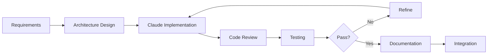
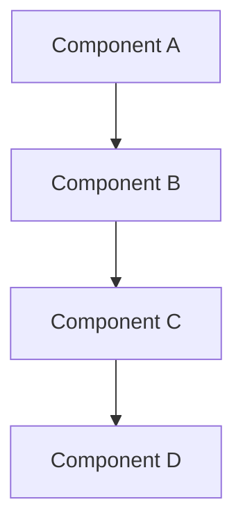

# Veridian OS: Claude Development Guide

## Table of Contents

1. [Introduction](#introduction)
2. [Claude Development Workflow](#claude-development-workflow)
3. [Project Structure & Organization](#project-structure--organization)
4. [Phase-Specific Development Guides](#phase-specific-development-guides)
5. [Prompting Strategies for OS Development](#prompting-strategies-for-os-development)
6. [Code Generation Templates](#code-generation-templates)
7. [Architecture Decision Support](#architecture-decision-support)
8. [Testing & Verification Strategies](#testing--verification-strategies)
9. [Performance Optimization Workflow](#performance-optimization-workflow)
10. [Security Implementation Guide](#security-implementation-guide)
11. [Documentation Generation](#documentation-generation)
12. [Common Patterns & Anti-Patterns](#common-patterns--anti-patterns)
13. [Troubleshooting Guide](#troubleshooting-guide)
14. [Best Practices](#best-practices)

## Introduction

This guide provides structured approaches for using Claude 4 Opus through Claude Code to develop Veridian OS. It includes specific prompting strategies, code organization patterns, and development workflows optimized for OS development.

### Prerequisites

- Familiarity with Rust programming language
- Basic understanding of OS concepts
- Access to Claude Code terminal interface
- Development environment with Rust toolchain

### How to Use This Guide

1. **Sequential Development**: Follow phase-specific guides in order
2. **Reference**: Use templates and patterns for common tasks
3. **Iteration**: Refine implementations based on testing feedback
4. **Documentation**: Generate docs alongside code

## Claude Development Workflow

### 1. Initial Project Setup

```bash
# Create project structure
mkdir -p veridian-os/{kernel,libs,drivers,services,userland,tools,docs}
cd veridian-os

# Initialize Rust workspace
cat > Cargo.toml << 'EOF'
[workspace]
members = [
    "kernel",
    "libs/*",
    "drivers/*",
    "services/*",
    "userland/*",
    "tools/*",
]

[profile.dev]
panic = "abort"

[profile.release]
panic = "abort"
lto = true
codegen-units = 1
EOF
```

### 2. Iterative Development Cycle



### 3. Claude Interaction Pattern

For each component:
1. **Design Phase**: Discuss architecture and interfaces
2. **Implementation Phase**: Generate code with tests
3. **Review Phase**: Analyze and optimize implementation
4. **Documentation Phase**: Generate comprehensive docs

## Project Structure & Organization

### Recommended Directory Layout

```
veridian-os/
├── kernel/
│   ├── src/
│   │   ├── arch/           # Architecture-specific code
│   │   │   ├── x86_64/
│   │   │   ├── aarch64/
│   │   │   └── riscv64/
│   │   ├── mm/             # Memory management
│   │   ├── sched/          # Scheduler
│   │   ├── cap/            # Capability system
│   │   ├── ipc/            # Inter-process communication
│   │   └── main.rs         # Kernel entry point
│   ├── Cargo.toml
│   └── build.rs
├── libs/
│   ├── libveridian/        # Core system library
│   ├── libcap/             # Capability library
│   └── libhal/             # Hardware abstraction
├── drivers/
│   ├── uart/               # Serial driver
│   ├── nvme/               # NVMe driver
│   └── net/                # Network drivers
├── services/
│   ├── init/               # Init system
│   ├── vfs/                # Virtual file system
│   └── netstack/           # Network stack
├── userland/
│   ├── shell/              # System shell
│   ├── coreutils/          # Core utilities
│   └── devtools/           # Development tools
├── tools/
│   ├── mkimage/            # Image creation tool
│   ├── debugger/           # Kernel debugger
│   └── profiler/           # Performance profiler
└── docs/
    ├── architecture/       # Architecture documentation
    ├── api/                # API documentation
    └── guides/             # User guides
```

### Module Organization Principles

1. **Single Responsibility**: Each module has one clear purpose
2. **Clear Dependencies**: Explicit dependency declarations
3. **Testability**: Design for testing from the start
4. **Documentation**: Document as you code

## Phase-Specific Development Guides

### Phase 0: Foundation & Tooling

#### Boot Loader Development Prompt Template

```
Create a UEFI bootloader for Veridian OS with the following requirements:
- Support for x86_64 architecture initially
- Load kernel ELF binary from FAT32 partition
- Set up initial page tables for higher-half kernel
- Pass memory map and boot information to kernel
- Include early console output for debugging
- Implement secure boot verification stub

Technical constraints:
- Use rust-osdev/uefi-rs for UEFI interaction
- Target x86_64-unknown-uefi
- Keep bootloader size under 512KB
- Use no_std and no external allocator

Please provide:
1. Cargo.toml configuration
2. Main bootloader implementation
3. Memory map parsing
4. ELF loading logic
5. Page table setup
6. Boot information structure
```

#### Build System Setup

```
Design a build system for Veridian OS that:
- Supports cross-compilation to multiple architectures
- Generates bootable images (ISO, disk images)
- Includes debugging symbols in debug builds
- Strips binaries for release builds
- Supports incremental builds
- Integrates with cargo workspace

Requirements:
- Use just (justfile) for build automation
- Support QEMU testing targets
- Include code coverage targets
- Generate documentation
- Support different boot methods (UEFI, BIOS)

Provide:
1. Justfile with all targets
2. Build configuration files
3. Linker scripts for each architecture
4. Image generation scripts
```

### Phase 1: Core Kernel Development

#### Memory Management Implementation

```
Implement a physical memory manager for Veridian OS with:

Requirements:
- Buddy allocator for physical frames
- Support for 4KB, 2MB, and 1GB pages
- NUMA awareness from the start
- Memory region tracking (usable, reserved, MMIO)
- Early boot allocator for pre-init allocation
- Thread-safe allocation/deallocation

Architecture:
- Use const generics for page sizes
- Implement as a global allocator
- Support memory hot-plug preparation
- Track allocation statistics

Provide:
1. Frame allocator trait definition
2. Buddy allocator implementation
3. Memory region management
4. NUMA node detection and tracking
5. Statistics and debugging interfaces
6. Comprehensive unit tests
```

#### Virtual Memory Management

```
Create a virtual memory management system that:

Features:
- Multi-level page table management (4/5 level)
- Support for different page sizes
- Copy-on-write implementation
- Demand paging infrastructure
- Address space isolation
- Guard page support

Technical requirements:
- Architecture-agnostic design
- Support for KASLR
- W^X enforcement
- Cache attribute management
- TLB shootdown mechanism

Include:
1. Page table abstractions
2. Address space structure
3. Page fault handler
4. Memory mapping APIs
5. Fork/CoW implementation
6. Performance optimizations
```

#### Process and Thread Management

```
Design a process management system with:

Core features:
- Process and thread abstractions
- Hierarchical process relationships
- Resource limit enforcement
- CPU affinity support
- Priority management
- Signal handling framework

Scheduling requirements:
- Pluggable scheduler architecture
- O(1) scheduling operations
- Real-time scheduling class
- CPU load balancing
- Power-aware scheduling

Provide:
1. Process/Thread structures
2. Scheduler trait and implementations
3. Context switching (arch-specific)
4. Process creation/termination
5. Resource accounting
6. Testing framework
```

### Phase 2: System Services

#### IPC System Design

```
Implement a capability-based IPC system featuring:

Core mechanisms:
- Synchronous message passing
- Asynchronous channels
- Zero-copy transfers
- Capability passing
- Multicast support

Performance requirements:
- < 1μs latency for small messages
- Zero-copy for large transfers
- Lock-free implementation where possible
- NUMA-aware message routing

Security features:
- Capability-based access control
- Message size limits
- Rate limiting
- Audit trail support

Provide:
1. IPC primitives design
2. Message and channel types
3. Capability passing mechanism
4. Performance optimizations
5. Security enforcement
6. Benchmarking suite
```

#### Device Driver Framework

```
Create a userspace driver framework supporting:

Architecture:
- Drivers run in userspace with minimal privileges
- Hardware access through capability-controlled MMIO
- Interrupt forwarding to userspace
- DMA buffer management
- Hot-plug support

Safety requirements:
- Memory isolation between drivers
- Fault recovery mechanisms
- Resource usage limits
- Performance isolation

Driver interfaces:
- Block device abstraction
- Network device abstraction
- Character device abstraction
- Bus enumeration APIs

Include:
1. Driver framework design
2. Device manager service
3. Example drivers (UART, timer)
4. Testing infrastructure
5. Performance measurement
```

### Phase 3: Advanced Features

#### Network Stack Implementation

```
Design a modern network stack with:

Architecture:
- Modular protocol design
- Zero-copy packet processing
- Hardware offload support
- Multi-queue NIC support
- eBPF integration ready

Protocol support:
- Ethernet with VLAN
- IPv4/IPv6 dual stack
- TCP with modern congestion control
- UDP with multicast
- QUIC-ready infrastructure

Performance features:
- RSS/RPS support
- GRO/GSO implementation
- Kernel bypass preparation
- NUMA-aware packet processing

Provide:
1. Network stack architecture
2. Packet buffer management
3. Protocol implementations
4. Socket API design
5. Performance optimizations
6. Testing strategies
```

## Prompting Strategies for OS Development

### 1. Architecture Design Prompts

```
When designing a new subsystem for Veridian OS, I need:

1. Architecture overview:
   - Component responsibilities
   - Interface definitions  
   - Data flow diagrams
   - Dependency relationships

2. Implementation strategy:
   - Key data structures
   - Algorithms to use
   - Performance considerations
   - Security implications

3. Integration points:
   - How it fits with existing systems
   - Required kernel interfaces
   - Capability requirements
   - Testing approach

Specific subsystem: [SUBSYSTEM NAME]
Context: [CURRENT STATE OF OS]
Constraints: [TECHNICAL CONSTRAINTS]
```

### 2. Implementation Prompts

```
Implement [COMPONENT] for Veridian OS with these specifications:

Functional requirements:
- [List specific features needed]

Non-functional requirements:
- Performance: [specific metrics]
- Memory usage: [constraints]
- Safety: [Rust safety requirements]
- Security: [security model integration]

Technical constraints:
- no_std environment
- Architecture: [x86_64/aarch64/riscv64]
- Integration with: [existing components]

Please provide:
1. Complete implementation with comments
2. Unit tests with edge cases
3. Integration test scenarios
4. Benchmarks for critical paths
5. Documentation with examples
```

### 3. Optimization Prompts

```
Optimize the [COMPONENT] implementation for:

Current performance metrics:
- [Metric 1]: [current value]
- [Metric 2]: [current value]

Target improvements:
- [Metric 1]: [target value]
- [Metric 2]: [target value]

Constraints:
- Maintain safety guarantees
- Preserve API compatibility
- Memory budget: [limit]

Consider:
- Cache optimization strategies
- Lock-free alternatives
- SIMD opportunities
- Allocation reduction
- Hot path identification

Provide optimized implementation with:
1. Performance analysis
2. Benchmark comparisons
3. Trade-off discussion
```

### 4. Security Review Prompts

```
Review [COMPONENT] for security vulnerabilities:

Focus areas:
1. Input validation
2. Resource exhaustion
3. Race conditions
4. Capability leaks
5. Integer overflows
6. Side channels

Current implementation:
[paste code or reference]

Security model context:
- Capability requirements
- Trust boundaries
- Threat model assumptions

Provide:
1. Vulnerability analysis
2. Suggested fixes
3. Additional security measures
4. Test cases for vulnerabilities
```

## Code Generation Templates

### 1. Kernel Module Template

```rust
//! # Module Name
//! 
//! Brief description of module purpose and functionality.

#![no_std]
#![feature(const_generics, async_fn_in_trait)]

use core::sync::atomic::{AtomicU64, Ordering};
use alloc::vec::Vec;

use crate::prelude::*;

/// Module configuration constants
pub mod config {
    pub const MAX_ENTRIES: usize = 1024;
    pub const DEFAULT_TIMEOUT: Duration = Duration::from_millis(100);
}

/// Error types for this module
#[derive(Debug, Clone, Copy, PartialEq, Eq)]
pub enum Error {
    InvalidParameter,
    ResourceExhausted,
    PermissionDenied,
}

impl From<Error> for KernelError {
    fn from(err: Error) -> Self {
        KernelError::ModuleError("module_name", err as i32)
    }
}

/// Main structure for the module
pub struct ModuleName {
    // Fields with documentation
    state: AtomicU64,
    data: Mutex<Vec<Entry>>,
}

impl ModuleName {
    /// Creates a new instance with default configuration
    pub fn new() -> Self {
        Self {
            state: AtomicU64::new(0),
            data: Mutex::new(Vec::with_capacity(config::MAX_ENTRIES)),
        }
    }

    /// Main operation method
    pub fn operation(&self, param: u64) -> Result<u64, Error> {
        // Implementation
        Ok(0)
    }
}

// Safety documentation for unsafe operations
unsafe impl Send for ModuleName {}
unsafe impl Sync for ModuleName {}

#[cfg(test)]
mod tests {
    use super::*;

    #[test]
    fn test_basic_operation() {
        let module = ModuleName::new();
        assert_eq!(module.operation(42).unwrap(), 0);
    }
}
```

### 2. Driver Template

```rust
//! # Driver Name
//! 
//! Hardware driver for [device description]

#![no_std]
#![no_main]

use veridian_driver_framework::prelude::*;

/// Driver metadata
#[driver_info]
static DRIVER_INFO: DriverInfo = DriverInfo {
    name: "driver_name",
    version: "0.1.0",
    author: "Veridian OS Team",
    description: "Brief driver description",
    license: "MIT",
};

/// Device identification
#[derive(Debug, Clone, Copy)]
pub struct DeviceId {
    vendor: u16,
    device: u16,
    subsystem: u32,
}

/// Driver state
pub struct DriverState {
    device: Device,
    config: Configuration,
    stats: Statistics,
}

/// Driver entry point
#[driver_entry]
fn driver_init(device: Device) -> Result<Box<dyn Driver>, DriverError> {
    // Verify device compatibility
    let id = device.id();
    if !is_supported_device(&id) {
        return Err(DriverError::UnsupportedDevice);
    }

    // Initialize hardware
    let state = DriverState::new(device)?;
    
    Ok(Box::new(state))
}

impl Driver for DriverState {
    fn probe(&mut self) -> Result<(), DriverError> {
        // Hardware initialization
        Ok(())
    }

    fn remove(&mut self) -> Result<(), DriverError> {
        // Cleanup
        Ok(())
    }

    fn suspend(&mut self) -> Result<(), DriverError> {
        // Power management
        Ok(())
    }

    fn resume(&mut self) -> Result<(), DriverError> {
        // Power management
        Ok(())
    }
}

/// Device-specific operations
impl DriverState {
    fn read_register(&self, offset: u32) -> u32 {
        unsafe { self.device.mmio_read(offset) }
    }

    fn write_register(&self, offset: u32, value: u32) {
        unsafe { self.device.mmio_write(offset, value) }
    }
}
```

### 3. System Service Template

```rust
//! # Service Name
//! 
//! System service providing [functionality]

#![no_std]
#![no_main]

use veridian_service_framework::prelude::*;

/// Service configuration
#[derive(Debug, Deserialize)]
pub struct Config {
    port: u16,
    max_clients: usize,
    timeout: Duration,
}

/// Service state
pub struct ServiceState {
    config: Config,
    clients: Vec<ClientHandle>,
    statistics: ServiceStats,
}

/// Service entry point
#[service_main]
async fn service_main(init: ServiceInit) -> Result<Never, ServiceError> {
    // Load configuration
    let config: Config = init.load_config()?;
    
    // Initialize service
    let mut state = ServiceState::new(config);
    
    // Register capabilities
    let cap = init.register_capability("service_name", Capability::new())?;
    
    // Main service loop
    loop {
        select! {
            req = init.receive_request() => {
                state.handle_request(req).await?;
            }
            _ = init.shutdown_signal() => {
                state.shutdown().await?;
                break;
            }
        }
    }
}

impl ServiceState {
    async fn handle_request(&mut self, req: Request) -> Result<(), ServiceError> {
        match req.message_type() {
            MessageType::Connect => self.handle_connect(req).await,
            MessageType::Disconnect => self.handle_disconnect(req).await,
            MessageType::Data => self.handle_data(req).await,
            _ => Err(ServiceError::UnknownMessage),
        }
    }
}
```

## Architecture Decision Support

### Decision Framework

When making architectural decisions, use this framework:

```
For architectural decision about [TOPIC]:

Context:
- Current system state
- Problem to solve
- Constraints

Options to consider:
1. [Option 1]
   - Pros:
   - Cons:
   - Implementation complexity:
   - Performance impact:

2. [Option 2]
   - Pros:
   - Cons:
   - Implementation complexity:
   - Performance impact:

Evaluation criteria:
- Security implications
- Performance characteristics
- Maintainability
- Future extensibility
- Implementation effort

Recommendation with rationale:
```

### Common Architecture Decisions

1. **Synchronous vs Asynchronous APIs**
   - Default to async for I/O operations
   - Use sync for CPU-bound operations
   - Consider hybrid approaches

2. **Monolithic vs Microkernel Services**
   - Core memory/scheduling in kernel
   - Drivers in userspace
   - File systems as services

3. **Memory Allocation Strategies**
   - Slab allocator for fixed-size
   - Buddy allocator for variable
   - Pool allocators for performance

## Testing & Verification Strategies

### Unit Testing Approach

```rust
#[cfg(test)]
mod tests {
    use super::*;
    use proptest::prelude::*;

    // Basic functionality tests
    #[test]
    fn test_normal_operation() {
        // Arrange
        let component = Component::new();
        
        // Act
        let result = component.operation(42);
        
        // Assert
        assert_eq!(result, Ok(84));
    }

    // Property-based tests
    proptest! {
        #[test]
        fn test_invariants(input: u64) {
            let component = Component::new();
            let result = component.operation(input);
            
            // Verify invariants hold
            prop_assert!(component.verify_invariants());
        }
    }

    // Concurrent testing
    #[test]
    fn test_concurrent_access() {
        use std::sync::Arc;
        use std::thread;

        let component = Arc::new(Component::new());
        let mut handles = vec![];

        for i in 0..10 {
            let comp = Arc::clone(&component);
            handles.push(thread::spawn(move || {
                comp.operation(i)
            }));
        }

        for handle in handles {
            assert!(handle.join().unwrap().is_ok());
        }
    }
}
```

### Integration Testing Strategy

```rust
// tests/integration/subsystem_test.rs
use veridian_test_framework::*;

#[integration_test]
async fn test_subsystem_integration() {
    // Set up test environment
    let env = TestEnvironment::new()
        .with_config(TestConfig::default())
        .with_mock_hardware()
        .build();

    // Initialize subsystems
    let memory_mgr = env.create_memory_manager();
    let process_mgr = env.create_process_manager();

    // Test interaction
    let process = process_mgr.create_process("test").await?;
    let memory = memory_mgr.allocate(4096)?;
    
    process.map_memory(memory, VirtAddr::new(0x1000))?;
    
    // Verify behavior
    assert_eq!(process.memory_usage(), 4096);
}
```

## Performance Optimization Workflow

### 1. Profiling Integration

```
Profile [COMPONENT] performance:

1. Identify hot paths using:
   - CPU profiling (perf, flamegraphs)
   - Memory profiling (heaptrack)
   - Lock contention analysis

2. Current bottlenecks:
   - [List identified issues]

3. Optimization targets:
   - Function: [name], current: [time], target: [time]
   - Memory: current: [usage], target: [usage]

4. Proposed optimizations:
   - [List specific changes]
```

### 2. Optimization Techniques

```rust
// Before optimization
pub fn process_data(data: &[u8]) -> Vec<ProcessedItem> {
    data.iter()
        .map(|&byte| ProcessedItem::from_byte(byte))
        .collect()
}

// After optimization
pub fn process_data_optimized(data: &[u8]) -> Vec<ProcessedItem> {
    // Pre-allocate exact size
    let mut result = Vec::with_capacity(data.len());
    
    // Process in chunks for cache efficiency
    const CHUNK_SIZE: usize = 64;
    for chunk in data.chunks(CHUNK_SIZE) {
        // Unroll inner loop
        for &byte in chunk {
            result.push(ProcessedItem::from_byte_fast(byte));
        }
    }
    
    result
}

// SIMD optimization where applicable
#[cfg(target_arch = "x86_64")]
pub fn process_data_simd(data: &[u8]) -> Vec<ProcessedItem> {
    use std::arch::x86_64::*;
    
    // SIMD implementation
    unsafe {
        // Process 16 bytes at a time with SSE
    }
}
```

## Security Implementation Guide

### Capability System Implementation

```rust
/// Capability implementation checklist:
/// 
/// 1. Unforgeable tokens
/// 2. Rights propagation
/// 3. Revocation support
/// 4. Audit trail
/// 5. Badge verification

pub struct CapabilityTable {
    /// Next capability ID
    next_id: AtomicU64,
    /// Active capabilities
    capabilities: RwLock<HashMap<CapabilityId, Capability>>,
    /// Revocation list
    revoked: RwLock<HashSet<CapabilityId>>,
    /// Audit log
    audit: AuditLog,
}

impl CapabilityTable {
    /// Create a new capability
    pub fn create_capability(
        &self,
        object: KernelObject,
        rights: CapabilityRights,
        badge: u64,
    ) -> Result<CapabilityId, CapError> {
        // Generate unforgeable ID
        let id = CapabilityId(self.next_id.fetch_add(1, Ordering::SeqCst));
        
        // Create capability with provenance
        let cap = Capability {
            id,
            object: object.clone(),
            rights,
            badge,
            generation: 1,
            provenance: CapabilityProvenance::Created {
                timestamp: current_time(),
                creator: current_process_id(),
            },
        };
        
        // Audit
        self.audit.log(AuditEvent::CapabilityCreated {
            id,
            object: object.id(),
            rights,
        });
        
        // Store
        self.capabilities.write().insert(id, cap);
        
        Ok(id)
    }
    
    /// Derive a capability with reduced rights
    pub fn derive_capability(
        &self,
        parent: CapabilityId,
        new_rights: CapabilityRights,
        new_badge: u64,
    ) -> Result<CapabilityId, CapError> {
        let caps = self.capabilities.read();
        let parent_cap = caps.get(&parent)
            .ok_or(CapError::InvalidCapability)?;
        
        // Verify rights subset
        if !new_rights.is_subset_of(parent_cap.rights) {
            return Err(CapError::InsufficientRights);
        }
        
        // Create derived capability
        let new_id = CapabilityId(self.next_id.fetch_add(1, Ordering::SeqCst));
        let derived = Capability {
            id: new_id,
            object: parent_cap.object.clone(),
            rights: new_rights,
            badge: new_badge,
            generation: parent_cap.generation + 1,
            provenance: CapabilityProvenance::Derived {
                parent: parent,
                timestamp: current_time(),
                deriver: current_process_id(),
            },
        };
        
        drop(caps);
        self.capabilities.write().insert(new_id, derived);
        
        Ok(new_id)
    }
}
```

### Security Checklist

For each component, verify:

- [ ] Input validation on all external data
- [ ] Bounds checking on array/buffer access  
- [ ] Integer overflow protection
- [ ] Resource limit enforcement
- [ ] Capability verification before access
- [ ] Audit logging for security events
- [ ] Safe error handling (no info leaks)
- [ ] Time-of-check-time-of-use (TOCTOU) prevention
- [ ] Side-channel resistance where applicable

## Documentation Generation

### API Documentation Template

```rust
/// Brief one-line description.
/// 
/// More detailed explanation of what this function/type does,
/// why it exists, and when to use it.
/// 
/// # Arguments
/// 
/// * `param1` - Description of first parameter
/// * `param2` - Description of second parameter
/// 
/// # Returns
/// 
/// Description of return value and possible error conditions.
/// 
/// # Errors
/// 
/// This function will return an error if:
/// - Condition 1 that causes Error1
/// - Condition 2 that causes Error2
/// 
/// # Examples
/// 
/// ```no_run
/// # use veridian_os::example::*;
/// let result = function_name(arg1, arg2)?;
/// assert_eq!(result, expected_value);
/// # Ok::<(), Error>(())
/// ```
/// 
/// # Safety
/// 
/// This function is unsafe because:
/// - Reason 1
/// - Reason 2
/// 
/// The caller must ensure:
/// - Precondition 1
/// - Precondition 2
/// 
/// # Panics
/// 
/// This function will panic if:
/// - Panic condition 1
/// - Panic condition 2
/// 
/// # Performance
/// 
/// Time complexity: O(n)
/// Space complexity: O(1)
/// 
/// This function is optimized for [use case].
pub fn function_name(param1: Type1, param2: Type2) -> Result<ReturnType, Error> {
    // Implementation
}
```

### Architecture Documentation

```markdown
# Component Name Architecture

## Overview

Brief description of the component's purpose and role in the system.

## Design Goals

1. Goal 1 with rationale
2. Goal 2 with rationale
3. Goal 3 with rationale

## Architecture

### High-Level Design



### Key Abstractions

1. **Abstraction 1**: Description and purpose
2. **Abstraction 2**: Description and purpose
3. **Abstraction 3**: Description and purpose

### Data Flow

Describe how data flows through the component.

## Implementation Details

### Critical Algorithms

1. **Algorithm 1**: Description, complexity, trade-offs
2. **Algorithm 2**: Description, complexity, trade-offs

### Concurrency Model

Describe threading, locking, and synchronization.

### Performance Considerations

- Hot paths and optimizations
- Cache usage patterns
- Memory allocation strategy

## Security Model

### Trust Boundaries

Define trust boundaries and security domains.

### Capability Requirements

List required capabilities and their usage.

### Threat Mitigation

Describe how specific threats are mitigated.

## Testing Strategy

### Unit Tests

Describe unit testing approach and coverage goals.

### Integration Tests

Describe integration testing scenarios.

### Performance Tests

List performance benchmarks and targets.

## Future Considerations

### Planned Enhancements

1. Enhancement 1
2. Enhancement 2

### Known Limitations

1. Limitation 1 and potential solutions
2. Limitation 2 and potential solutions
```

## Common Patterns & Anti-Patterns

### Patterns to Use

#### 1. Builder Pattern for Complex Types

```rust
pub struct ProcessBuilder {
    name: Option<String>,
    priority: Priority,
    capabilities: CapabilitySet,
    // ... more fields
}

impl ProcessBuilder {
    pub fn new() -> Self {
        Self::default()
    }
    
    pub fn name(mut self, name: impl Into<String>) -> Self {
        self.name = Some(name.into());
        self
    }
    
    pub fn priority(mut self, priority: Priority) -> Self {
        self.priority = priority;
        self
    }
    
    pub fn build(self) -> Result<Process, ProcessError> {
        let name = self.name.ok_or(ProcessError::MissingName)?;
        // Validate and construct
        Ok(Process { /* ... */ })
    }
}
```

#### 2. Type State Pattern for Protocols

```rust
pub struct Connection<S: State> {
    socket: Socket,
    _state: PhantomData<S>,
}

pub struct Disconnected;
pub struct Connected;
pub struct Authenticated;

impl Connection<Disconnected> {
    pub fn connect(self, addr: SocketAddr) -> Result<Connection<Connected>, Error> {
        // Connection logic
    }
}

impl Connection<Connected> {
    pub fn authenticate(self, creds: Credentials) -> Result<Connection<Authenticated>, Error> {
        // Auth logic
    }
}
```

#### 3. RAII for Resource Management

```rust
pub struct MappedMemory {
    addr: VirtAddr,
    size: usize,
    // Automatically unmapped on drop
}

impl Drop for MappedMemory {
    fn drop(&mut self) {
        unsafe {
            unmap_memory(self.addr, self.size);
        }
    }
}
```

### Anti-Patterns to Avoid

#### 1. Avoid Global Mutable State

```rust
// Bad: Global mutable state
static mut GLOBAL_COUNTER: u64 = 0;

// Good: Use atomics or thread-local
static COUNTER: AtomicU64 = AtomicU64::new(0);
thread_local! {
    static LOCAL_BUFFER: RefCell<Vec<u8>> = RefCell::new(Vec::new());
}
```

#### 2. Avoid Panic in Kernel Code

```rust
// Bad: Can panic
let value = vec[index];

// Good: Handle errors
let value = vec.get(index).ok_or(Error::IndexOutOfBounds)?;
```

#### 3. Avoid Unbounded Allocations

```rust
// Bad: Unbounded allocation
let buffer = Vec::with_capacity(user_provided_size);

// Good: Enforce limits
const MAX_BUFFER_SIZE: usize = 1024 * 1024; // 1MB
let size = user_provided_size.min(MAX_BUFFER_SIZE);
let buffer = Vec::with_capacity(size);
```

## Troubleshooting Guide

### Common Development Issues

#### 1. Linking Errors

**Problem**: Undefined symbols during linking
```
error: linking with `rust-lld` failed: exit status: 1
  = note: rust-lld: error: undefined symbol: __rust_alloc
```

**Solution**:
1. Ensure `#![no_std]` is used correctly
2. Provide custom allocator implementation
3. Check that panic handler is defined

#### 2. Boot Failures

**Problem**: System fails to boot or hangs early

**Debugging steps**:
1. Enable early serial output
2. Add checkpoint messages
3. Use QEMU with `-d int,cpu_reset`
4. Check GDT/IDT setup
5. Verify stack alignment

#### 3. Memory Corruption

**Problem**: Random crashes or corruption

**Investigation**:
1. Enable memory poisoning
2. Use guard pages
3. Check for stack overflows
4. Verify allocator correctness
5. Run with sanitizers in tests

### Performance Issues

#### 1. High Latency

**Diagnosis**:
```rust
// Add timing measurements
let start = read_tsc();
operation();
let cycles = read_tsc() - start;
if cycles > THRESHOLD {
    log::warn!("Operation took {} cycles", cycles);
}
```

#### 2. Lock Contention

**Detection**:
```rust
// Lock contention monitoring
pub struct MonitoredMutex<T> {
    inner: Mutex<T>,
    contention_count: AtomicU64,
    hold_time: AtomicU64,
}
```

## Best Practices

### 1. Code Organization

- Keep modules focused and cohesive
- Use visibility modifiers appropriately
- Separate interface from implementation
- Group related functionality

### 2. Error Handling

- Use `Result<T, E>` for fallible operations
- Create specific error types
- Provide context in errors
- Never panic in kernel code

### 3. Performance

- Profile before optimizing
- Design for cache efficiency
- Minimize allocations
- Use const generics for compile-time optimization

### 4. Safety

- Document all unsafe blocks
- Minimize unsafe surface area
- Use safe abstractions
- Verify invariants in debug builds

### 5. Testing

- Write tests alongside code
- Use property-based testing
- Test error conditions
- Benchmark performance-critical code

### 6. Documentation

- Document public APIs thoroughly
- Include examples
- Explain "why" not just "what"
- Keep docs up to date

## Claude-Specific Tips

### 1. Iterative Development

Break complex components into smaller pieces:
```
First, let's design the interface for [component].
Next, implement the core functionality.
Then, add error handling and edge cases.
Finally, optimize for performance.
```

### 2. Code Review Requests

```
Please review this implementation for:
1. Correctness and safety
2. Performance bottlenecks
3. Security vulnerabilities
4. API design improvements
5. Missing test cases
```

### 3. Architecture Exploration

```
I'm considering these approaches for [problem]:
1. [Approach A]
2. [Approach B]

Can you analyze the trade-offs considering:
- Performance implications
- Implementation complexity
- Maintenance burden
- Future extensibility
```

### 4. Debugging Assistance

```
I'm experiencing [issue] with this code:
[code snippet]

Symptoms:
- [Symptom 1]
- [Symptom 2]

What I've tried:
- [Attempt 1]
- [Attempt 2]

Can you help identify the root cause?
```

## Conclusion

This guide provides a structured approach to developing Veridian OS using Claude. Key takeaways:

1. **Iterative Development**: Build incrementally with continuous testing
2. **Clear Communication**: Use specific prompts and provide context
3. **Safety First**: Leverage Rust's type system and verify invariants
4. **Performance Awareness**: Profile and optimize based on data
5. **Documentation**: Document as you build

Remember that OS development is complex and requires patience. Use Claude as a collaborative partner, leveraging its ability to:
- Generate boilerplate and common patterns
- Review code for issues
- Explore architectural decisions
- Debug complex problems
- Optimize performance

The combination of human insight and Claude's capabilities can accelerate development while maintaining high quality standards. Good luck building Veridian OS!