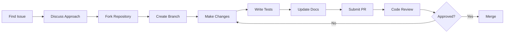

# Contributing to Veridian OS

Welcome to the Veridian OS project! We're excited that you're interested in contributing to the next generation of operating systems. This guide will help you get started with contributing to Veridian OS.

## Table of Contents

1. [Code of Conduct](#code-of-conduct)
2. [Getting Started](#getting-started)
3. [Development Setup](#development-setup)
4. [How to Contribute](#how-to-contribute)
5. [Coding Standards](#coding-standards)
6. [Testing Requirements](#testing-requirements)
7. [Documentation Standards](#documentation-standards)
8. [Commit Guidelines](#commit-guidelines)
9. [Pull Request Process](#pull-request-process)
10. [Community Guidelines](#community-guidelines)

## Code of Conduct

### Our Pledge

We are committed to providing a friendly, safe, and welcoming environment for all contributors, regardless of experience level, gender identity and expression, sexual orientation, disability, personal appearance, body size, race, ethnicity, age, religion, or nationality.

### Expected Behavior

- Be respectful and considerate in communication
- Welcome newcomers and help them get started
- Focus on constructive criticism
- Respect differing viewpoints and experiences
- Show empathy towards other community members

### Unacceptable Behavior

- Harassment, discrimination, or offensive comments
- Personal attacks or derogatory language
- Publishing others' private information
- Inappropriate sexual attention or advances
- Trolling, insulting comments, or political attacks

### Enforcement

Violations should be reported to conduct@veridian-os.org. All complaints will be reviewed and investigated promptly and fairly.

## Getting Started

### Prerequisites

Before contributing, ensure you have:

1. **Rust Knowledge**: Familiarity with Rust programming language
2. **OS Concepts**: Basic understanding of operating system concepts
3. **Git Proficiency**: Comfortable with Git version control
4. **Hardware Access**: x86_64, ARM64, or RISC-V development machine

### Required Reading

1. [Veridian OS Architecture Document](docs/architecture.md)
2. [Security Model](docs/security.md)
3. [API Guidelines](docs/api-guidelines.md)
4. [Testing Strategy](docs/testing.md)

### Communication Channels

- **Discord**: [discord.veridian-os.org](https://discord.veridian-os.org) - Real-time chat
- **Zulip**: [zulip.veridian-os.org](https://zulip.veridian-os.org) - Development discussions
- **Forum**: [forum.veridian-os.org](https://forum.veridian-os.org) - Long-form discussions
- **Mailing List**: dev@veridian-os.org - Announcements and RFCs

## Development Setup

### Environment Setup

1. **Install Rust Toolchain**
```bash
# Install rustup
curl --proto '=https' --tlsv1.2 -sSf https://sh.rustup.rs | sh

# Install nightly toolchain
rustup toolchain install nightly-2025-01-15

# Set as default for Veridian OS
rustup override set nightly-2025-01-15

# Install required components
rustup component add rust-src rustfmt clippy llvm-tools-preview
```

2. **Install Development Tools**
```bash
# Core tools
cargo install cargo-watch cargo-expand cargo-binutils

# Testing tools
cargo install cargo-nextest cargo-tarpaulin

# Security tools
cargo install cargo-audit cargo-deny

# Cross-compilation
rustup target add x86_64-unknown-none aarch64-unknown-none
```

3. **Clone Repository**
```bash
git clone https://github.com/veridian-os/veridian.git
cd veridian

# Create development branch
git checkout -b feature/your-feature-name
```

4. **Build System Setup**
```bash
# Install Just command runner
cargo install just

# Verify setup
just doctor

# Build kernel
just build-all
```

### IDE Configuration

#### VS Code
```json
// .vscode/settings.json
{
    "rust-analyzer.cargo.target": "x86_64-unknown-none",
    "rust-analyzer.checkOnSave.allTargets": false,
    "rust-analyzer.cargo.features": ["test-framework"],
    "editor.formatOnSave": true,
    "editor.rulers": [100],
    "files.insertFinalNewline": true,
    "files.trimTrailingWhitespace": true
}
```

#### IntelliJ IDEA
1. Install Rust plugin
2. Configure project SDK to use nightly toolchain
3. Enable format on save
4. Set up external tools for cargo commands

## How to Contribute

### Types of Contributions

1. **Code Contributions**
   - Bug fixes
   - New features
   - Performance improvements
   - Refactoring

2. **Documentation**
   - API documentation
   - User guides
   - Architecture documentation
   - Translation

3. **Testing**
   - Writing test cases
   - Bug reporting
   - Performance testing
   - Security testing

4. **Design**
   - UI/UX improvements
   - Architecture proposals
   - Logo and branding
   - Website development

### Finding Work

1. **Good First Issues**
   - Look for issues labeled `good-first-issue`
   - Start with documentation or simple bug fixes
   - Ask for guidance in issue comments

2. **Feature Requests**
   - Check issues labeled `enhancement`
   - Discuss implementation approach before starting
   - Create RFC for significant changes

3. **Bug Fixes**
   - Look for issues labeled `bug`
   - Reproduce the issue first
   - Add regression tests

### Contribution Workflow



## Coding Standards

### Rust Style Guide

#### General Rules
- Use `rustfmt` for all code formatting
- Follow Rust API guidelines
- Prefer safe code over unsafe
- Document all public APIs
- Write self-documenting code

#### Naming Conventions
```rust
// Modules: snake_case
mod memory_manager;

// Types: PascalCase
struct FrameAllocator;
trait MemoryMapper;
enum PageSize;

// Functions: snake_case
fn allocate_frame() -> Frame;

// Constants: SCREAMING_SNAKE_CASE
const PAGE_SIZE: usize = 4096;

// Variables: snake_case
let frame_count = 100;
```

#### Code Organization
```rust
// Standard module organization
// 1. Imports
use core::mem;
use alloc::vec::Vec;

// 2. Module declarations
mod tests;

// 3. Constants
const BUFFER_SIZE: usize = 1024;

// 4. Type definitions
struct Buffer {
    data: [u8; BUFFER_SIZE],
}

// 5. Trait definitions
trait Readable {
    fn read(&mut self, buf: &mut [u8]) -> Result<usize>;
}

// 6. Implementations
impl Buffer {
    pub fn new() -> Self {
        Self {
            data: [0; BUFFER_SIZE],
        }
    }
}

// 7. Functions
pub fn process_buffer(buffer: &Buffer) -> Result<()> {
    // Implementation
}
```

#### Error Handling
```rust
// Use custom error types
#[derive(Debug, thiserror::Error)]
pub enum MemoryError {
    #[error("out of memory")]
    OutOfMemory,
    
    #[error("invalid address: {0:#x}")]
    InvalidAddress(usize),
    
    #[error("page fault at {address:#x}")]
    PageFault { address: usize },
}

// Use Result for fallible operations
pub fn allocate_page() -> Result<Page, MemoryError> {
    // Implementation
}

// Avoid panic! in kernel code
// BAD
fn get_page(index: usize) -> &Page {
    &self.pages[index]  // Can panic
}

// GOOD
fn get_page(index: usize) -> Option<&Page> {
    self.pages.get(index)
}
```

#### Unsafe Code Guidelines
```rust
// Document safety requirements
/// Allocates a frame from the physical memory.
///
/// # Safety
///
/// The caller must ensure that:
/// - The frame allocator has been initialized
/// - No other thread is currently allocating frames
/// - The returned frame is properly mapped before use
pub unsafe fn allocate_frame_unchecked() -> Frame {
    // Implementation
}

// Minimize unsafe scope
// BAD
unsafe {
    let ptr = allocate_raw(size);
    zero_memory(ptr, size);
    let slice = slice::from_raw_parts_mut(ptr, size);
    process_slice(slice);
}

// GOOD
let ptr = unsafe { allocate_raw(size) };
unsafe { zero_memory(ptr, size) };
let slice = unsafe { slice::from_raw_parts_mut(ptr, size) };
process_slice(slice);  // Safe function
```

### Performance Guidelines

1. **Measure Before Optimizing**
   - Use benchmarks to identify bottlenecks
   - Profile with `perf` or `flamegraph`
   - Document performance characteristics

2. **Zero-Cost Abstractions**
   - Prefer compile-time polymorphism
   - Use const generics where appropriate
   - Avoid unnecessary allocations

3. **Cache-Friendly Code**
   - Consider data layout for cache efficiency
   - Use `#[repr(align(64))]` for cache-line alignment
   - Minimize pointer chasing

## Testing Requirements

### Test Categories

1. **Unit Tests**
   ```rust
   #[cfg(test)]
   mod tests {
       use super::*;
       
       #[test]
       fn test_frame_allocation() {
           let mut allocator = FrameAllocator::new();
           let frame = allocator.allocate().unwrap();
           assert_eq!(frame.size(), PAGE_SIZE);
       }
   }
   ```

2. **Integration Tests**
   ```rust
   // tests/integration/memory_test.rs
   #![no_std]
   #![no_main]
   
   use veridian_test::*;
   
   #[test_case]
   fn test_memory_mapping() {
       let page = Page::containing_address(VirtAddr::new(0x1000));
       let frame = allocate_frame().unwrap();
       
       map_page(page, frame, PageFlags::WRITABLE);
       
       // Test write and read
       let ptr = 0x1000 as *mut u64;
       unsafe {
           ptr.write_volatile(0xDEADBEEF);
           assert_eq!(ptr.read_volatile(), 0xDEADBEEF);
       }
   }
   ```

3. **Property-Based Tests**
   ```rust
   use proptest::prelude::*;
   
   proptest! {
       #[test]
       fn test_allocator_never_double_allocates(
           allocation_count in 1..100usize
       ) {
           let mut allocator = FrameAllocator::new();
           let mut allocated = HashSet::new();
           
           for _ in 0..allocation_count {
               if let Some(frame) = allocator.allocate() {
                   assert!(allocated.insert(frame.start_address()));
               }
           }
       }
   }
   ```

### Test Coverage Requirements

- Minimum 80% code coverage for new code
- Critical paths require 95% coverage
- All unsafe code must have tests
- Integration tests for all public APIs

### Running Tests

```bash
# Run all tests
just test-all

# Run specific test suite
cargo test --package veridian-kernel

# Run with coverage
cargo tarpaulin --out Html

# Run integration tests in QEMU
just test-integration

# Run benchmarks
cargo bench --bench memory_benchmarks
```

## Documentation Standards

### Code Documentation

#### Module Documentation
```rust
//! # Memory Management Module
//!
//! This module provides physical and virtual memory management for Veridian OS.
//!
//! ## Overview
//!
//! The memory manager handles:
//! - Physical frame allocation
//! - Virtual address mapping
//! - Page table management
//!
//! ## Examples
//!
//! ```no_run
//! use veridian::memory::*;
//!
//! let mut allocator = FrameAllocator::new();
//! let frame = allocator.allocate().expect("out of memory");
//! ```
```

#### Function Documentation
```rust
/// Allocates a physical frame from the frame allocator.
///
/// This function searches for a free frame in the physical memory
/// and marks it as allocated.
///
/// # Returns
///
/// Returns `Some(Frame)` if a frame is available, or `None` if
/// out of memory.
///
/// # Examples
///
/// ```
/// let frame = allocate_frame().expect("out of memory");
/// assert_eq!(frame.size(), 4096);
/// ```
///
/// # Panics
///
/// Panics if the frame allocator has not been initialized.
pub fn allocate_frame() -> Option<Frame> {
    // Implementation
}
```

### Documentation Requirements

1. All public items must have documentation
2. Include examples for complex APIs
3. Document panic conditions
4. Explain unsafe requirements
5. Add links to related items

### Architecture Documentation

Use ASCII diagrams for architecture:
```
┌─────────────────────────────────────┐
│         Application Layer           │
├─────────────────────────────────────┤
│          Service Layer              │
├─────────────────────────────────────┤
│           IPC Layer                 │
├─────────────────────────────────────┤
│         Microkernel Core            │
├─────────────────────────────────────┤
│      Hardware Abstraction           │
└─────────────────────────────────────┘
```

## Commit Guidelines

### Commit Message Format

```
<type>(<scope>): <subject>

<body>

<footer>
```

#### Types
- `feat`: New feature
- `fix`: Bug fix
- `docs`: Documentation changes
- `style`: Code style changes (formatting)
- `refactor`: Code refactoring
- `perf`: Performance improvements
- `test`: Test additions or modifications
- `build`: Build system changes
- `ci`: CI/CD changes
- `chore`: Maintenance tasks

#### Examples
```
feat(kernel): add support for huge pages

This commit adds support for 2MB and 1GB huge pages in the
virtual memory system. The implementation includes:

- Detection of huge page support in CPU
- Page table modifications for huge page entries
- Frame allocator support for huge page allocation

Closes #123
```

```
fix(scheduler): prevent priority inversion in real-time tasks

Real-time tasks could experience priority inversion when
waiting for locks held by lower-priority tasks. This fix
implements priority inheritance for mutexes.

The solution temporarily boosts the priority of lock holders
to match waiting higher-priority tasks.

Fixes #456
```

### Commit Best Practices

1. **Atomic Commits**: Each commit should represent one logical change
2. **Compile-Ready**: Every commit should compile successfully
3. **Test-Ready**: All tests should pass for each commit
4. **Clear Messages**: Write clear, descriptive commit messages
5. **Sign Commits**: Use `git commit -s` to sign commits

## Pull Request Process

### Before Submitting

1. **Update from Main**
   ```bash
   git fetch upstream
   git rebase upstream/main
   ```

2. **Run Tests**
   ```bash
   just test-all
   ```

3. **Check Formatting**
   ```bash
   cargo fmt --all -- --check
   cargo clippy --all -- -D warnings
   ```

4. **Update Documentation**
   - Add/update relevant documentation
   - Update CHANGELOG.md if applicable

### PR Template

```markdown
## Description
Brief description of changes

## Motivation
Why are these changes needed?

## Changes
- List of specific changes
- Breaking changes (if any)

## Testing
- How has this been tested?
- Test configurations

## Checklist
- [ ] Code follows project style guidelines
- [ ] Self-review completed
- [ ] Comments added for complex code
- [ ] Documentation updated
- [ ] Tests added/updated
- [ ] All tests passing
- [ ] No new warnings

## Related Issues
Closes #XXX
```

### Review Process

1. **Automated Checks**
   - CI/CD must pass
   - Code coverage maintained
   - No security vulnerabilities

2. **Peer Review**
   - At least 2 approvals required
   - Domain expert review for core changes
   - Security review for security-related changes

3. **Response Time**
   - Initial review within 48 hours
   - Address feedback promptly
   - Ping reviewers after updates

### After Merge

1. Delete your feature branch
2. Update your local repository
3. Consider follow-up tasks
4. Help with release notes if needed

## Community Guidelines

### Being a Good Community Member

1. **Help Others**
   - Answer questions in chat/forums
   - Review pull requests
   - Mentor newcomers

2. **Share Knowledge**
   - Write blog posts
   - Give talks
   - Create tutorials

3. **Stay Informed**
   - Follow project announcements
   - Participate in RFC discussions
   - Attend community meetings

### Recognition

We recognize contributors through:
- Contributor spotlight in newsletter
- Speaking opportunities at conferences
- Maintainer status for consistent contributors
- Annual contributor awards

### Getting Help

If you need help:
1. Check documentation first
2. Search existing issues
3. Ask in Discord `#help` channel
4. Create a discussion thread
5. Email dev@veridian-os.org for sensitive issues

## License

By contributing to Veridian OS, you agree that your contributions will be licensed under the same license as the project (Apache 2.0 / MIT dual license).

## Thank You!

Thank you for contributing to Veridian OS! Your efforts help build a more secure and performant future for operating systems. We look forward to your contributions!

For any questions not covered in this guide, please reach out to the community through our communication channels.