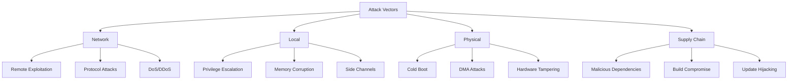
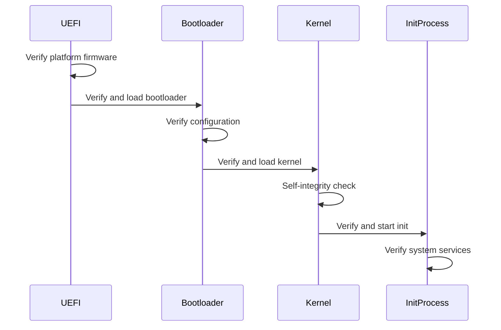

# Veridian OS Security Architecture & Threat Model

## Executive Summary

This document outlines the comprehensive security architecture of Veridian OS, including threat modeling, security principles, mitigation strategies, and implementation guidelines. Veridian OS employs defense-in-depth strategies with multiple security layers, leveraging Rust's memory safety guarantees and modern hardware security features.

## Table of Contents

1. [Security Principles](#security-principles)
2. [Threat Model](#threat-model)
3. [Security Architecture](#security-architecture)
4. [Hardware Security Features](#hardware-security-features)
5. [Software Security Measures](#software-security-measures)
6. [Cryptographic Architecture](#cryptographic-architecture)
7. [Supply Chain Security](#supply-chain-security)
8. [Incident Response](#incident-response)
9. [Security Auditing](#security-auditing)
10. [Compliance Framework](#compliance-framework)

## Security Principles

### Core Security Tenets

1. **Principle of Least Privilege**
   - Every component runs with minimal required permissions
   - Capabilities are fine-grained and non-ambient
   - Default deny for all operations

2. **Defense in Depth**
   - Multiple independent security layers
   - Failure of one layer doesn't compromise the system
   - Hardware and software security features complement each other

3. **Secure by Default**
   - All features ship in their most secure configuration
   - Security opt-out rather than opt-in
   - Clear warnings for security-reducing operations

4. **Transparent Security**
   - Security mechanisms are auditable
   - No security through obscurity
   - Open source for community review

5. **Fail Secure**
   - System fails to a secure state
   - No information leakage on failure
   - Graceful degradation of functionality

## Threat Model

### Threat Actors

1. **External Attackers**
   - Remote attackers without physical access
   - Capabilities: Network attacks, software exploitation
   - Motivation: Data theft, system compromise, ransomware

2. **Malicious Insiders**
   - Users with legitimate access
   - Capabilities: Privilege escalation, data exfiltration
   - Motivation: Corporate espionage, sabotage

3. **Supply Chain Attackers**
   - Compromise through dependencies or build process
   - Capabilities: Backdoors, malicious updates
   - Motivation: Persistent access, mass surveillance

4. **Physical Attackers**
   - Direct hardware access
   - Capabilities: Cold boot attacks, hardware implants
   - Motivation: Targeted data extraction

### Attack Vectors



### Security Boundaries

1. **Kernel/User Space Boundary**
   - Hardware-enforced privilege separation
   - System call interface validation
   - No direct hardware access from user space

2. **Process Isolation**
   - Address space isolation
   - Capability-based resource access
   - Secure IPC mechanisms

3. **Network Boundaries**
   - Firewall at network edge
   - Process-level network isolation
   - Encrypted communications by default

## Security Architecture

### Layered Security Model

```
┌─────────────────────────────────────────────────────────────┐
│                    Security Monitor                         │
│              (Logs, Alerts, Compliance)                     │
├─────────────────────────────────────────────────────────────┤
│                  Application Layer                          │
│     (Sandboxed Apps, Capability Restrictions)              │
├─────────────────────────────────────────────────────────────┤
│                   Service Layer                             │
│    (Authenticated Services, Encrypted Storage)              │
├─────────────────────────────────────────────────────────────┤
│                    IPC Layer                                │
│      (Validated Messages, Capability Checks)                │
├─────────────────────────────────────────────────────────────┤
│                 Microkernel Layer                           │
│   (Memory Protection, Capability Management)                │
├─────────────────────────────────────────────────────────────┤
│               Hardware Security Layer                       │
│  (Secure Boot, TPM, Memory Encryption, IOMMU)             │
└─────────────────────────────────────────────────────────────┘
```

### Capability-Based Security

#### Capability Model
```rust
pub struct Capability {
    // Unique identifier
    id: CapabilityId,
    
    // Object reference
    object: ObjectRef,
    
    // Permitted operations
    rights: CapabilityRights,
    
    // Unforgeable badge
    badge: u64,
    
    // Temporal validity
    generation: u64,
    
    // Audit trail
    provenance: CapabilityProvenance,
}

bitflags! {
    pub struct CapabilityRights: u64 {
        const READ         = 0x0001;
        const WRITE        = 0x0002;
        const EXECUTE      = 0x0004;
        const DELETE       = 0x0008;
        const GRANT        = 0x0010;
        const REVOKE       = 0x0020;
        const DUPLICATE    = 0x0040;
        const TRANSFER     = 0x0080;
        const SEAL         = 0x0100;
        const UNSEAL       = 0x0200;
    }
}
```

#### Capability Operations
1. **Creation**: Only kernel can create new capabilities
2. **Delegation**: Controlled transfer with rights attenuation
3. **Revocation**: Immediate or lazy revocation strategies
4. **Validation**: Every operation checks capability validity

### Memory Protection

#### Address Space Layout Randomization (ASLR)
- Kernel ASLR with KASLR
- Per-process randomization
- Stack, heap, and library randomization
- Entropy sources from hardware RNG

#### Memory Tagging
```rust
pub struct TaggedMemory {
    // Hardware memory tagging support
    tagging_enabled: bool,
    
    // Tag size (4-6 bits depending on architecture)
    tag_bits: u8,
    
    // Tag granularity (typically 16 bytes)
    granule_size: usize,
}

impl TaggedMemory {
    pub fn allocate_tagged(&mut self, size: usize) -> TaggedPointer {
        let tag = self.generate_random_tag();
        let ptr = self.allocate_raw(size);
        
        // Apply hardware memory tags
        self.apply_memory_tags(ptr, size, tag);
        
        TaggedPointer {
            address: self.tag_pointer(ptr, tag),
            size,
            tag,
        }
    }
}
```

#### Stack Protection
- Stack canaries with random values
- Guard pages between stacks
- Shadow stacks for return addresses
- Stack isolation between privilege levels

## Hardware Security Features

### CPU Security Features

#### Intel/AMD x86_64
- **SMEP**: Supervisor Mode Execution Prevention
- **SMAP**: Supervisor Mode Access Prevention
- **CET**: Control-flow Enforcement Technology
- **UMIP**: User Mode Instruction Prevention
- **LA57**: 5-level paging for larger address space

#### ARM
- **Pointer Authentication**: PAC instructions
- **Branch Target Identification**: BTI
- **Memory Tagging Extension**: MTE
- **Confidential Compute Architecture**: CCA

### Secure Boot Chain



### Trusted Platform Module (TPM) Integration

#### TPM Usage
1. **Measured Boot**: PCR measurements at each stage
2. **Sealed Storage**: Encryption keys sealed to PCR values
3. **Remote Attestation**: Prove system integrity
4. **Random Number Generation**: Hardware entropy source

#### PCR Allocation
```
PCR 0-7:  UEFI firmware measurements
PCR 8:    Bootloader configuration
PCR 9:    Bootloader binary
PCR 10:   Kernel binary
PCR 11:   Kernel configuration
PCR 12:   Init process
PCR 13:   System services
PCR 14:   Security policies
PCR 15:   Application measurements
PCR 16+:  Available for applications
```

### Confidential Computing

#### Intel TDX Support
```rust
pub struct TdxGuest {
    // TD guest attestation
    td_report: TdReport,
    
    // Encrypted memory regions
    private_memory: Vec<MemoryRegion>,
    
    // Shared memory for I/O
    shared_memory: Vec<SharedRegion>,
}

impl TdxGuest {
    pub fn get_attestation_report(&self) -> Result<AttestationReport> {
        // Generate TD report
        let report = tdcall::get_report(&self.td_report)?;
        
        // Get TD quote for remote attestation
        let quote = self.get_td_quote(report)?;
        
        Ok(AttestationReport {
            report,
            quote,
            measurements: self.get_measurements(),
        })
    }
}
```

## Software Security Measures

### Compiler Security Features

#### Rust Compiler Flags
```toml
[profile.release]
overflow-checks = true
lto = "fat"
opt-level = 3
codegen-units = 1

[profile.release.package."*"]
opt-level = 2
strip = "symbols"
```

#### Security Hardening Flags
- Stack protector: `-Z stack-protector=strong`
- Position Independent Executables: `-C relocation-model=pic`
- Fortify source: Custom implementations in Rust
- Control Flow Guard: `-C control-flow-guard`

### Runtime Security

#### Sandboxing
```rust
pub struct ProcessSandbox {
    // Capability restrictions
    capabilities: CapabilitySet,
    
    // System call filters
    seccomp_filter: SeccompFilter,
    
    // Resource limits
    rlimits: ResourceLimits,
    
    // Namespace isolation
    namespaces: NamespaceSet,
}

impl ProcessSandbox {
    pub fn apply(&self, process: &mut Process) -> Result<()> {
        // Apply capability restrictions
        process.drop_capabilities(&self.capabilities)?;
        
        // Install seccomp filters
        process.install_seccomp(&self.seccomp_filter)?;
        
        // Set resource limits
        process.set_rlimits(&self.rlimits)?;
        
        // Enter namespaces
        process.enter_namespaces(&self.namespaces)?;
        
        Ok(())
    }
}
```

#### Security Monitoring
- Real-time security event logging
- Anomaly detection algorithms
- Behavioral analysis
- Intrusion detection system

### Network Security

#### Firewall Architecture
```rust
pub struct Firewall {
    // Rule chains
    input_chain: RuleChain,
    output_chain: RuleChain,
    forward_chain: RuleChain,
    
    // Connection tracking
    conntrack: ConnectionTracker,
    
    // Rate limiting
    rate_limiter: RateLimiter,
}

pub struct FirewallRule {
    // Match conditions
    source: IpNetwork,
    destination: IpNetwork,
    protocol: Protocol,
    port: PortRange,
    
    // Action
    action: FirewallAction,
    
    // Logging
    log_level: LogLevel,
}
```

## Cryptographic Architecture

### Cryptographic Primitives

#### Algorithm Selection
- **Symmetric Encryption**: ChaCha20-Poly1305, AES-256-GCM
- **Asymmetric Encryption**: Curve25519, P-256
- **Hashing**: BLAKE3, SHA-3
- **Key Derivation**: Argon2id, HKDF
- **Digital Signatures**: Ed25519, ECDSA-P256

#### Post-Quantum Readiness
```rust
pub enum SignatureAlgorithm {
    // Classical algorithms
    Ed25519,
    EcdsaP256,
    
    // Post-quantum algorithms
    MlDsa44,    // NIST ML-DSA-44
    MlDsa65,    // NIST ML-DSA-65
    MlDsa87,    // NIST ML-DSA-87
    SlhDsa128s, // NIST SLH-DSA-128s
    
    // Hybrid schemes
    HybridEd25519MlDsa44,
}
```

### Key Management

#### Key Hierarchy
```
Master Key (Hardware-backed)
    ├── Key Encryption Keys (KEKs)
    │   ├── Storage Encryption Key
    │   ├── Communication Keys
    │   └── Application Keys
    └── Signing Keys
        ├── System Signing Key
        ├── Driver Signing Key
        └── Package Signing Key
```

#### Key Storage
- Hardware security module (HSM) integration
- TPM-backed key storage
- Encrypted key files with secure deletion
- Key rotation policies

## Supply Chain Security

### Build Security

#### Reproducible Builds
```yaml
# .github/workflows/reproducible-build.yml
name: Reproducible Build Verification

on:
  release:
    types: [published]

jobs:
  verify-reproducibility:
    runs-on: ubuntu-latest
    strategy:
      matrix:
        builder: [builder1, builder2, builder3]
    
    steps:
      - name: Build in isolated environment
        run: |
          docker run --rm \
            -e SOURCE_DATE_EPOCH=1234567890 \
            -e RUST_VERSION=nightly-2025-01-15 \
            veridian/build-env \
            cargo build --release
      
      - name: Calculate checksums
        run: |
          sha256sum target/release/veridian > build-${{ matrix.builder }}.sha256
      
      - name: Verify reproducibility
        run: |
          # Compare checksums across builders
          diff build-builder1.sha256 build-builder2.sha256
          diff build-builder2.sha256 build-builder3.sha256
```

### Dependency Security

#### Cargo Audit Configuration
```toml
# .cargo/audit.toml
[advisories]
vulnerability = "deny"
unmaintained = "warn"
unsound = "deny"
yanked = "deny"
notice = "warn"

[licenses]
unlicensed = "deny"
copyleft = "warn"
default = "deny"
confidence-threshold = 0.8

[[licenses.allow]]
name = "MIT"
version = "*"

[[licenses.allow]]
name = "Apache-2.0"
version = "*"
```

### Binary Transparency

#### Signed Releases
```rust
pub struct ReleaseSigner {
    signing_key: SigningKey,
    transparency_log: TransparencyLogClient,
}

impl ReleaseSigner {
    pub async fn sign_release(&self, binary: &[u8]) -> Result<SignedRelease> {
        // Calculate hashes
        let blake3_hash = blake3::hash(binary);
        let sha256_hash = sha256::hash(binary);
        
        // Create signature
        let signature = self.signing_key.sign(&blake3_hash);
        
        // Submit to transparency log
        let log_entry = self.transparency_log
            .submit(blake3_hash, signature)
            .await?;
        
        Ok(SignedRelease {
            binary_hash: blake3_hash,
            sha256_hash,
            signature,
            transparency_proof: log_entry.proof,
        })
    }
}
```

## Incident Response

### Incident Response Plan

#### Response Phases
1. **Detection**: Automated monitoring and alerting
2. **Analysis**: Determine scope and impact
3. **Containment**: Isolate affected systems
4. **Eradication**: Remove threats
5. **Recovery**: Restore normal operations
6. **Post-Incident**: Learn and improve

#### Security Response Team
```yaml
security_team:
  roles:
    - incident_commander: 
        responsibilities: ["coordinate response", "external communication"]
    - technical_lead:
        responsibilities: ["technical analysis", "remediation"]
    - communications_lead:
        responsibilities: ["user notification", "public disclosure"]
    
  escalation:
    - level1: 
        severity: ["low", "medium"]
        response_time: "24 hours"
    - level2:
        severity: ["high"]
        response_time: "4 hours"
    - level3:
        severity: ["critical"]
        response_time: "1 hour"
```

### Vulnerability Disclosure

#### Responsible Disclosure Process
1. **Report Reception**: security@veridian-os.org
2. **Acknowledgment**: Within 48 hours
3. **Initial Assessment**: Within 7 days
4. **Fix Development**: Based on severity
5. **Coordinated Disclosure**: 90-day deadline
6. **Public Advisory**: CVE assignment and announcement

## Security Auditing

### Audit Infrastructure

#### Audit Event Collection
```rust
pub struct AuditSystem {
    // Event collectors
    kernel_collector: KernelAuditCollector,
    process_collector: ProcessAuditCollector,
    network_collector: NetworkAuditCollector,
    
    // Event storage
    event_store: AuditEventStore,
    
    // Analysis engine
    analyzer: AuditAnalyzer,
}

#[derive(Serialize, Deserialize)]
pub struct AuditEvent {
    timestamp: SystemTime,
    event_type: AuditEventType,
    subject: Subject,
    object: Object,
    action: Action,
    result: ActionResult,
    context: EventContext,
}
```

#### Audit Analysis
- Real-time anomaly detection
- Compliance reporting
- Forensic analysis capabilities
- Correlation with threat intelligence

### Security Metrics

#### Key Performance Indicators
1. **Mean Time to Detect (MTTD)**: Target < 1 hour
2. **Mean Time to Respond (MTTR)**: Target < 4 hours
3. **Patch Coverage**: Target > 95% within 30 days
4. **Security Training Completion**: Target 100% annually
5. **Vulnerability Scan Coverage**: Target 100% monthly

## Compliance Framework

### Standards Compliance

#### Target Certifications
1. **Common Criteria**: EAL4+ for government deployments
2. **FIPS 140-3**: Level 2 for cryptographic modules
3. **ISO 27001**: Information security management
4. **SOC 2 Type II**: For cloud deployments
5. **PCI DSS**: For payment processing systems

#### Compliance Automation
```yaml
# compliance/controls.yml
controls:
  - id: AC-2
    title: "Account Management"
    implementation:
      - automated: true
        description: "Capability-based access control"
        evidence: ["audit logs", "capability chains"]
    
  - id: AU-2
    title: "Audit Events"
    implementation:
      - automated: true
        description: "Comprehensive audit system"
        evidence: ["audit configuration", "event samples"]
```

### Privacy Protection

#### Data Protection Features
1. **Encryption at Rest**: Mandatory for user data
2. **Encryption in Transit**: TLS 1.3 minimum
3. **Data Minimization**: Collect only necessary data
4. **Right to Deletion**: Secure data erasure
5. **Purpose Limitation**: Data used only for stated purposes

## Security Roadmap

### Phase 1: Foundation (Months 1-6)
- Core capability system
- Basic memory protection
- Secure boot implementation
- Initial audit system

### Phase 2: Hardening (Months 7-12)
- Hardware security feature integration
- Advanced sandboxing
- Network security implementation
- Cryptographic subsystem

### Phase 3: Advanced Features (Months 13-18)
- Confidential computing support
- Post-quantum cryptography
- Advanced threat detection
- Compliance automation

### Phase 4: Certification (Months 19-24)
- Security audit preparation
- Penetration testing
- Compliance certification
- Performance optimization

## Conclusion

The Veridian OS security architecture provides comprehensive protection through multiple layers of defense, leveraging both hardware and software security features. By following security-by-design principles and maintaining a strong security posture throughout development, Veridian OS aims to set new standards for operating system security.

Regular security assessments, continuous monitoring, and rapid response capabilities ensure that Veridian OS can adapt to evolving threats while maintaining the highest levels of security assurance.