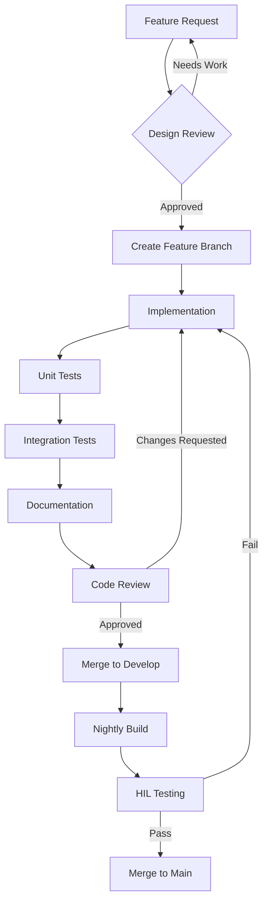
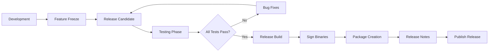
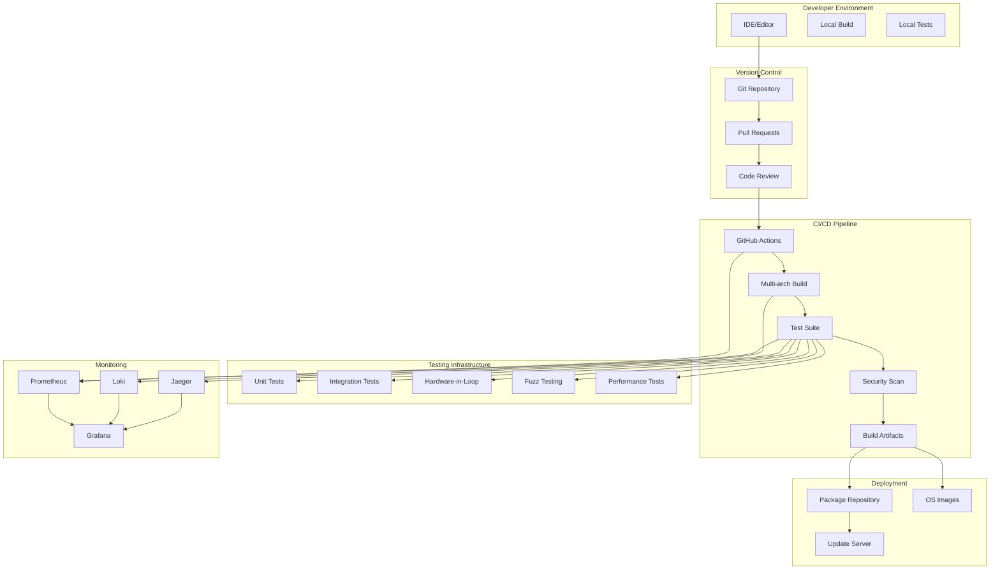
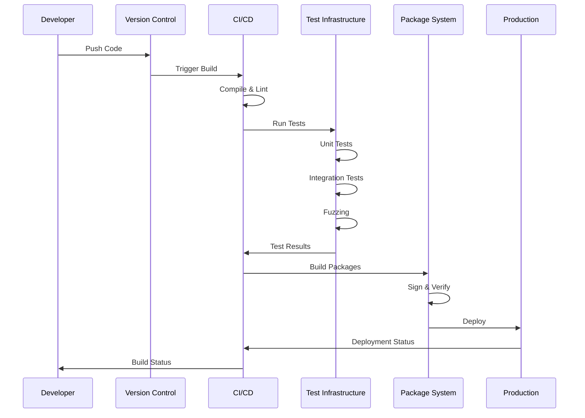

# Veridian OS: Software Development & Engineering Guide

## Table of Contents

1. [Development Environment Architecture](#development-environment-architecture)
2. [Core Development Tools](#core-development-tools)
3. [Version Control & Collaboration](#version-control--collaboration)
4. [Continuous Integration/Deployment](#continuous-integrationdeployment)
5. [Testing Infrastructure](#testing-infrastructure)
6. [Documentation Systems](#documentation-systems)
7. [Communication & Project Management](#communication--project-management)
8. [Performance & Debugging Tools](#performance--debugging-tools)
9. [Security & Compliance Tools](#security--compliance-tools)
10. [Development Workflows](#development-workflows)
11. [Architecture Diagrams](#architecture-diagrams)

## Development Environment Architecture

### Overview

The Veridian OS development environment is designed for maximum efficiency, reproducibility, and collaboration across distributed teams. It leverages containerization, virtualization, and cloud-native tools to ensure consistent development experiences.

### Development Environment Layers

```
┌─────────────────────────────────────────────────────────────────┐
│                     Developer Workstation                       │
│  ┌─────────────┐  ┌──────────────┐  ┌───────────────────────┐ │
│  │   VS Code   │  │   IntelliJ   │  │    Terminal/Shell     │ │
│  │ + rust-analyzer  + Rust Plugin │  │  + cargo + rustup     │ │
│  └─────────────┘  └──────────────┘  └───────────────────────┘ │
├─────────────────────────────────────────────────────────────────┤
│                    Development Container                        │
│  ┌─────────────────────────────────────────────────────────┐  │
│  │  Docker/Podman Container with Rust Toolchain            │  │
│  │  - Nightly Rust + cargo + rustfmt + clippy              │  │
│  │  - Cross-compilation toolchains                         │  │
│  │  - QEMU + KVM for testing                              │  │
│  └─────────────────────────────────────────────────────────┘  │
├─────────────────────────────────────────────────────────────────┤
│                    Remote Development                           │
│  ┌─────────────┐  ┌──────────────┐  ┌───────────────────┐    │
│  │   Gitpod    │  │GitHub Spaces │  │  Cloud VMs      │    │
│  │   Codespaces│  │              │  │  (AWS/GCP/Azure)│    │
│  └─────────────┘  └──────────────┘  └───────────────────┘    │
└─────────────────────────────────────────────────────────────────┘
```

## Core Development Tools

### 1. Rust Toolchain Management

#### rustup Configuration
```toml
# rust-toolchain.toml (project root)
[toolchain]
channel = "nightly-2025-01-15"
components = [
    "rust-src",
    "rust-analyzer",
    "rustfmt",
    "clippy",
    "llvm-tools-preview",
    "rust-docs"
]
targets = [
    "x86_64-unknown-none",
    "aarch64-unknown-none",
    "riscv64gc-unknown-none-elf",
    "wasm32-unknown-unknown"  # For WASM runtime
]
profile = "complete"
```

#### Cargo Extensions
```bash
# Essential cargo extensions
cargo install cargo-watch      # Auto-rebuild on changes
cargo install cargo-expand     # Macro expansion
cargo install cargo-asm       # Assembly output
cargo install cargo-binutils  # Binary utilities
cargo install cargo-bloat     # Binary size analysis
cargo install cargo-outdated  # Dependency updates
cargo install cargo-audit     # Security audits
cargo install cargo-deny      # Supply chain security
cargo install cargo-machete   # Unused dependency detection
cargo install cargo-nextest   # Next-generation test runner
```

### 2. IDE and Editor Setup

#### VS Code Extensions
```json
{
  "recommendations": [
    "rust-lang.rust-analyzer",
    "vadimcn.vscode-lldb",
    "serayuzgur.crates",
    "tamasfe.even-better-toml",
    "usernamehw.errorlens",
    "streetsidesoftware.code-spell-checker",
    "yzhang.markdown-all-in-one",
    "hediet.vscode-drawio",
    "ms-vscode.hexeditor",
    "formulahendry.code-runner",
    "github.copilot",
    "eamodio.gitlens"
  ]
}
```

#### IntelliJ IDEA Setup
- Install Rust plugin
- Configure external tools for cargo commands
- Set up remote debugging configurations
- Enable memory profiler integration

### 3. Build System Tools

#### Just (Command Runner)
```just
# justfile
default:
    just --list

# Build kernel for all targets
build-all:
    cargo build --target x86_64-unknown-none
    cargo build --target aarch64-unknown-none
    cargo build --target riscv64gc-unknown-none-elf

# Run tests with coverage
test-coverage:
    cargo tarpaulin --out Html --output-dir coverage

# Generate documentation
docs:
    cargo doc --no-deps --document-private-items
    mdbook build docs/

# Run QEMU with kernel
run target="x86_64":
    cargo run --target {{target}}-unknown-none -- \
        -serial stdio -display none
```

#### Bazel Integration (Optional)
```python
# WORKSPACE.bazel
load("@rules_rust//rust:repositories.bzl", "rules_rust_dependencies", "rust_register_toolchains")

rules_rust_dependencies()
rust_register_toolchains(
    edition = "2021",
    versions = ["nightly/2025-01-15"],
)
```

## Version Control & Collaboration

### Git Configuration

#### .gitattributes
```gitattributes
# Rust files
*.rs text eol=lf
*.toml text eol=lf

# Binary files
*.img binary
*.elf binary
*.bin binary

# Documentation
*.md text eol=lf
docs/** linguist-documentation

# Vendor files
vendor/** linguist-vendored
```

#### Git Hooks (using cargo-husky)
```toml
# .cargo-husky/hooks/pre-commit
#!/bin/sh
set -e

# Format check
cargo fmt -- --check

# Lint check
cargo clippy -- -D warnings

# Security audit
cargo audit

# Test critical components
cargo test --package veridian-kernel --lib
```

### GitHub Integration

#### Branch Protection Rules
```yaml
# .github/branch-protection.yml
protection_rules:
  main:
    required_reviews: 2
    dismiss_stale_reviews: true
    require_code_owner_reviews: true
    required_status_checks:
      - "CI / Build (x86_64)"
      - "CI / Build (aarch64)"
      - "CI / Test Suite"
      - "Security / Audit"
    enforce_admins: false
    restrictions:
      users: ["lead-maintainers"]
```

#### Issue Templates
```markdown
<!-- .github/ISSUE_TEMPLATE/bug_report.md -->
---
name: Bug Report
about: Report a bug in Veridian OS
labels: bug, triage
---

**Component**: [kernel/userspace/drivers/other]
**Architecture**: [x86_64/aarch64/riscv64]
**Version**: [commit hash or version]

**Description**:
[Clear description of the bug]

**Reproduction Steps**:
1. [First step]
2. [Second step]
3. [...]

**Expected Behavior**:
[What should happen]

**Actual Behavior**:
[What actually happens]

**Logs/Stack Trace**:
```
[Paste relevant logs here]
```
```

## Continuous Integration/Deployment

### GitHub Actions Workflows

#### Main CI Pipeline
```yaml
# .github/workflows/ci.yml
name: Continuous Integration

on:
  push:
    branches: [main, develop]
  pull_request:
    types: [opened, synchronize, reopened]

env:
  RUST_BACKTRACE: 1
  CARGO_TERM_COLOR: always

jobs:
  # Formatting and Linting
  check:
    name: Check
    runs-on: ubuntu-latest
    steps:
      - uses: actions/checkout@v4
      - uses: dtolnay/rust-toolchain@nightly
        with:
          components: rustfmt, clippy
      
      - name: Cache dependencies
        uses: Swatinem/rust-cache@v2
        
      - name: Check formatting
        run: cargo fmt --all -- --check
        
      - name: Clippy
        run: cargo clippy --all-targets --all-features -- -D warnings

  # Multi-architecture builds
  build:
    name: Build
    runs-on: ${{ matrix.os }}
    strategy:
      matrix:
        os: [ubuntu-latest, macos-latest]
        target: 
          - x86_64-unknown-none
          - aarch64-unknown-none
          - riscv64gc-unknown-none-elf
    
    steps:
      - uses: actions/checkout@v4
      - uses: dtolnay/rust-toolchain@nightly
        with:
          targets: ${{ matrix.target }}
      
      - name: Build kernel
        run: cargo build --target ${{ matrix.target }} --release
      
      - name: Upload artifacts
        uses: actions/upload-artifact@v4
        with:
          name: kernel-${{ matrix.target }}
          path: target/${{ matrix.target }}/release/veridian*

  # Testing
  test:
    name: Test Suite
    runs-on: ubuntu-latest
    steps:
      - uses: actions/checkout@v4
      - uses: dtolnay/rust-toolchain@nightly
      
      - name: Install QEMU
        run: |
          sudo apt-get update
          sudo apt-get install -y qemu-system-x86 qemu-system-aarch64
      
      - name: Run unit tests
        run: cargo test --all
      
      - name: Run integration tests
        run: cargo test --test '*' --features integration-tests

  # Security scanning
  security:
    name: Security Audit
    runs-on: ubuntu-latest
    steps:
      - uses: actions/checkout@v4
      - uses: rustsec/audit-check@v1
        with:
          token: ${{ secrets.GITHUB_TOKEN }}
```

#### Hardware-in-the-Loop Testing
```yaml
# .github/workflows/hil-testing.yml
name: Hardware-in-the-Loop Tests

on:
  schedule:
    - cron: '0 2 * * *'  # Daily at 2 AM
  workflow_dispatch:

jobs:
  hil-test:
    runs-on: [self-hosted, hil-runner]
    strategy:
      matrix:
        board: [rpi4, rock5b, visionfive2]
    
    steps:
      - uses: actions/checkout@v4
      
      - name: Flash firmware
        run: |
          ./scripts/flash-${{ matrix.board }}.sh \
            target/aarch64-unknown-none/release/veridian.img
      
      - name: Run hardware tests
        run: |
          python3 tests/hil/runner.py \
            --board ${{ matrix.board }} \
            --timeout 300
```

### GitLab CI Alternative
```yaml
# .gitlab-ci.yml
stages:
  - check
  - build
  - test
  - deploy

variables:
  CARGO_HOME: ${CI_PROJECT_DIR}/.cargo

before_script:
  - rustup default nightly
  - rustup target add x86_64-unknown-none

check:lint:
  stage: check
  script:
    - cargo fmt -- --check
    - cargo clippy -- -D warnings

build:kernel:
  stage: build
  script:
    - cargo build --release --target x86_64-unknown-none
  artifacts:
    paths:
      - target/x86_64-unknown-none/release/veridian
```

## Testing Infrastructure

### Testing Framework Architecture

```
┌─────────────────────────────────────────────────────────────┐
│                    Test Orchestrator                        │
├─────────────────────────────────────────────────────────────┤
│  ┌──────────────┐  ┌──────────────┐  ┌────────────────┐   │
│  │  Unit Tests  │  │Integration   │  │ System Tests   │   │
│  │  (in-process)│  │Tests (QEMU)  │  │ (Full boot)    │   │
│  └──────────────┘  └──────────────┘  └────────────────┘   │
├─────────────────────────────────────────────────────────────┤
│  ┌──────────────┐  ┌──────────────┐  ┌────────────────┐   │
│  │   Fuzzing    │  │  Benchmarks  │  │Property Tests  │   │
│  │  (LibAFL)    │  │  (Criterion) │  │   (Proptest)   │   │
│  └──────────────┘  └──────────────┘  └────────────────┘   │
├─────────────────────────────────────────────────────────────┤
│                 Test Result Aggregation                     │
└─────────────────────────────────────────────────────────────┘
```

### Test Organization

#### Unit Test Setup
```rust
// tests/common/mod.rs
use veridian_kernel::test_framework::*;

pub fn setup_test_environment() -> TestEnv {
    TestEnv::builder()
        .with_memory_size(128 * 1024 * 1024)  // 128MB
        .with_cpu_count(4)
        .enable_serial_output()
        .build()
}

#[test_case]
fn test_memory_allocation() {
    let env = setup_test_environment();
    let allocator = env.get_frame_allocator();
    
    let frame = allocator.allocate().expect("allocation failed");
    assert!(frame.start_address().is_aligned(4096));
}
```

#### Integration Test Framework
```toml
# Cargo.toml
[dev-dependencies]
qemu-test = { path = "tools/qemu-test" }
serial-test = "2.0"
proptest = "1.0"
criterion = { version = "0.5", features = ["html_reports"] }

[[test]]
name = "integration"
harness = false
```

### Fuzzing Infrastructure

#### LibAFL Setup
```rust
// fuzz/fuzz_targets/syscall_fuzzer.rs
#![no_main]
use libfuzzer_sys::fuzz_target;
use veridian_kernel::syscall::*;

fuzz_target!(|data: &[u8]| {
    if data.len() < 8 { return; }
    
    let syscall_num = u64::from_le_bytes(data[0..8].try_into().unwrap());
    let args = &data[8..];
    
    // Fuzz syscall handling
    let _ = handle_syscall(syscall_num, args);
});
```

### Performance Benchmarking

#### Criterion Benchmarks
```rust
// benches/context_switch.rs
use criterion::{black_box, criterion_group, criterion_main, Criterion};

fn benchmark_context_switch(c: &mut Criterion) {
    let mut group = c.benchmark_group("context_switch");
    
    group.bench_function("minimal", |b| {
        b.iter(|| {
            black_box(perform_context_switch());
        })
    });
    
    group.bench_function("with_fpu", |b| {
        b.iter(|| {
            black_box(perform_context_switch_with_fpu());
        })
    });
    
    group.finish();
}

criterion_group!(benches, benchmark_context_switch);
criterion_main!(benches);
```

## Documentation Systems

### Documentation Architecture

```
┌─────────────────────────────────────────────────────────────┐
│                 Documentation Pipeline                      │
├─────────────────────────────────────────────────────────────┤
│  ┌──────────────┐  ┌──────────────┐  ┌────────────────┐   │
│  │ Source Code  │  │  Markdown    │  │  Architecture  │   │
│  │   (rustdoc)  │  │   (mdBook)   │  │  Diagrams      │   │
│  └──────────────┘  └──────────────┘  └────────────────┘   │
├─────────────────────────────────────────────────────────────┤
│                    Documentation Build                      │
│  ┌─────────────────────────────────────────────────────┐  │
│  │  Static Site Generator (Zola/Hugo)                   │  │
│  │  - API Reference                                     │  │
│  │  - User Guide                                        │  │
│  │  - Developer Guide                                   │  │
│  └─────────────────────────────────────────────────────┘  │
├─────────────────────────────────────────────────────────────┤
│              Documentation Hosting (GitHub Pages)           │
└─────────────────────────────────────────────────────────────┘
```

### mdBook Configuration
```toml
# book.toml
[book]
title = "Veridian OS Documentation"
authors = ["Veridian OS Team"]
language = "en"
multilingual = false
src = "src"

[build]
build-dir = "book"
create-missing = true

[preprocessor.mermaid]
command = "mdbook-mermaid"

[preprocessor.toc]
command = "mdbook-toc"
marker = "<!-- toc -->"

[output.html]
theme = "veridian-theme"
default-theme = "rust"
preferred-dark-theme = "coal"
curly-quotes = true
mathjax-support = true
git-repository-url = "https://github.com/veridian-os/veridian"
edit-url-template = "https://github.com/veridian-os/veridian/edit/main/docs/{path}"

[output.html.fold]
enable = true
level = 1
```

### Architecture Diagrams

#### PlantUML Integration
```plantuml
@startuml
!theme veridian
title Veridian OS Component Architecture

package "Kernel Space" {
    component [Microkernel] as kernel
    component [Memory Manager] as mm
    component [Scheduler] as sched
    component [IPC Manager] as ipc
}

package "User Space" {
    component [Device Drivers] as drivers
    component [File System] as fs
    component [Network Stack] as net
    component [System Services] as services
}

kernel --> mm
kernel --> sched
kernel --> ipc
drivers --> kernel : syscalls
fs --> kernel : syscalls
net --> kernel : syscalls
services --> kernel : syscalls

@enduml
```

## Communication & Project Management

### Communication Flow Diagram

```
┌─────────────────────────────────────────────────────────────┐
│                  Communication Hub                          │
├─────────────────────────────────────────────────────────────┤
│  ┌──────────────┐  ┌──────────────┐  ┌────────────────┐   │
│  │   Discord    │  │    Zulip     │  │    Matrix      │   │
│  │  (Community) │  │   (Dev Team) │  │  (Real-time)   │   │
│  └──────────────┘  └──────────────┘  └────────────────┘   │
├─────────────────────────────────────────────────────────────┤
│  ┌──────────────┐  ┌──────────────┐  ┌────────────────┐   │
│  │   GitHub     │  │     Jira     │  │   Confluence   │   │
│  │   Issues     │  │   (Epics)    │  │    (Docs)      │   │
│  └──────────────┘  └──────────────┘  └────────────────┘   │
├─────────────────────────────────────────────────────────────┤
│                 Integration Layer (Webhooks)                │
└─────────────────────────────────────────────────────────────┘
```

### Project Management Tools

#### GitHub Projects Setup
```yaml
# .github/project-board.yml
name: Veridian OS Roadmap
description: Main development tracking board

columns:
  - name: Backlog
    purpose: Ideas and future work
  - name: Ready
    purpose: Refined and ready to start
  - name: In Progress
    purpose: Active development
  - name: Review
    purpose: In code review
  - name: Done
    purpose: Completed work

automations:
  - trigger: issue_opened
    action: add_to_column
    column: Backlog
  - trigger: pull_request_opened
    action: add_to_column
    column: Review
```

#### Development Metrics Dashboard
```yaml
# grafana/dashboards/development.yml
dashboard:
  title: Veridian OS Development Metrics
  panels:
    - title: Build Success Rate
      type: graph
      datasource: prometheus
      query: |
        sum(rate(ci_build_success[24h])) / 
        sum(rate(ci_build_total[24h]))
    
    - title: Test Coverage
      type: stat
      datasource: prometheus
      query: |
        veridian_test_coverage_percent
    
    - title: Issue Resolution Time
      type: graph
      datasource: github
      query: |
        avg(issue_close_time - issue_open_time)
```

## Performance & Debugging Tools

### Performance Profiling Setup

#### Integrated Profiling Tools
```rust
// src/profile.rs
#[cfg(feature = "profiling")]
pub mod profile {
    use puffin::profile_function;
    
    pub fn init_profiler() {
        puffin::set_scopes_on(true);
        
        // Start puffin server for real-time profiling
        std::thread::spawn(|| {
            puffin_http::Server::new("0.0.0.0:8585").serve();
        });
    }
    
    #[profile_function]
    pub fn expensive_operation() {
        // Function will be profiled
    }
}
```

#### Tracy Integration
```toml
# Cargo.toml
[dependencies]
tracy-client = { version = "0.16", features = ["enable"] }

[profile.release]
debug = true  # Keep debug info for profiling
```

### Debugging Infrastructure

#### Remote Debugging Setup
```json
// .vscode/launch.json
{
  "version": "0.2.0",
  "configurations": [
    {
      "type": "lldb",
      "request": "custom",
      "name": "Debug Kernel (QEMU)",
      "targetCreateCommands": [
        "target create ${workspaceFolder}/target/x86_64-unknown-none/debug/veridian"
      ],
      "processCreateCommands": [
        "gdb-remote localhost:1234"
      ],
      "preLaunchTask": "start-qemu-debug"
    }
  ]
}
```

#### GDB Scripts
```python
# scripts/gdb/veridian.py
import gdb

class VeridianProcessList(gdb.Command):
    """List all Veridian OS processes"""
    
    def __init__(self):
        super().__init__("veridian-ps", gdb.COMMAND_USER)
    
    def invoke(self, arg, from_tty):
        process_list = gdb.parse_and_eval("PROCESS_LIST")
        # Parse and display process information
        
VeridianProcessList()
```

## Security & Compliance Tools

### Security Scanning Pipeline

```yaml
# .github/workflows/security.yml
name: Security Scanning

on:
  schedule:
    - cron: '0 0 * * *'
  workflow_dispatch:

jobs:
  dependency-scan:
    runs-on: ubuntu-latest
    steps:
      - uses: actions/checkout@v4
      
      - name: Run cargo-audit
        uses: rustsec/audit-check@v1
        
      - name: Run cargo-deny
        uses: EmbarkStudios/cargo-deny-action@v1
        with:
          log-level: warn
          command: check bans licenses sources
  
  static-analysis:
    runs-on: ubuntu-latest
    steps:
      - uses: actions/checkout@v4
      
      - name: Run cargo-geiger
        run: |
          cargo install cargo-geiger
          cargo geiger --all-features
      
      - name: MIRAI Abstract Interpretation
        run: |
          cargo install --git https://github.com/facebookexperimental/MIRAI
          cargo mirai
```

### Formal Verification Tools

#### Kani Setup
```rust
// src/verified/memory.rs
#[cfg(kani)]
mod verification {
    use super::*;
    
    #[kani::proof]
    fn verify_frame_allocator() {
        let mut allocator = FrameAllocator::new();
        
        // Verify allocation returns valid frame
        if let Some(frame) = allocator.allocate() {
            kani::assert(frame.start_address() % 4096 == 0);
            kani::assert(frame.size() == 4096);
        }
        
        // Verify no double allocation
        let frame1 = allocator.allocate();
        let frame2 = allocator.allocate();
        if let (Some(f1), Some(f2)) = (frame1, frame2) {
            kani::assert(f1.start_address() != f2.start_address());
        }
    }
}
```

## Development Workflows

### Feature Development Workflow



### Release Workflow



### Incident Response Workflow

```yaml
# .github/ISSUE_TEMPLATE/security_vulnerability.yml
name: Security Vulnerability Report
description: Report a security vulnerability
title: "[SECURITY] "
labels: ["security", "priority-critical"]
assignees: ["security-team"]
body:
  - type: markdown
    attributes:
      value: |
        Thanks for reporting a security vulnerability.
        Please use our PGP key for sensitive information.
  
  - type: input
    id: affected-versions
    attributes:
      label: Affected Versions
      placeholder: "e.g., 0.1.0 - 0.1.5"
    validations:
      required: true
  
  - type: textarea
    id: description
    attributes:
      label: Vulnerability Description
      description: Describe the security issue
    validations:
      required: true
  
  - type: dropdown
    id: severity
    attributes:
      label: Severity
      options:
        - Critical
        - High
        - Medium
        - Low
    validations:
      required: true
```

## Architecture Diagrams

### Overall Development Infrastructure



### Communication Flow Between Components



## Best Practices and Guidelines

### Code Quality Standards

1. **Rust Best Practices**
   - Use `clippy::pedantic` for enhanced linting
   - Maintain 90%+ test coverage for critical paths
   - Document all public APIs with examples
   - Use `#[must_use]` for important return values

2. **Security Guidelines**
   - Minimize `unsafe` usage (target <1% of codebase)
   - All `unsafe` blocks must have safety comments
   - Regular security audits with `cargo-audit`
   - Formal verification for critical components

3. **Performance Standards**
   - Benchmark all performance-critical paths
   - Profile before optimizing
   - Document performance characteristics
   - Set performance regression thresholds

### Development Environment Optimization

1. **Build Optimization**
   ```toml
   # .cargo/config.toml
   [build]
   jobs = 8
   incremental = true
   
   [target.x86_64-unknown-none]
   rustflags = [
       "-C", "link-arg=-z",
       "-C", "link-arg=max-page-size=4096",
       "-C", "force-frame-pointers=yes"
   ]
   ```

2. **Cache Configuration**
   - Use `sccache` for distributed builds
   - Configure CI caching for dependencies
   - Implement incremental compilation strategies

3. **Remote Development**
   - Gitpod/Codespaces configuration
   - Cloud development environments
   - Distributed build farms

### Continuous Improvement

1. **Metrics Collection**
   - Build time trends
   - Test execution time
   - Code coverage evolution
   - Dependency update frequency

2. **Feedback Loops**
   - Weekly team retrospectives
   - Monthly community feedback sessions
   - Quarterly architecture reviews
   - Annual security assessments

3. **Knowledge Sharing**
   - Internal tech talks
   - Documentation days
   - Pair programming sessions
   - External conference participation

## Conclusion

This comprehensive development and engineering guide provides the foundation for building Veridian OS with modern software engineering practices. By following these guidelines and utilizing the recommended tools, the development team can maintain high productivity while ensuring code quality, security, and performance throughout the project lifecycle.

The key to success lies in:
- **Automation**: Automate everything possible to reduce manual overhead
- **Consistency**: Maintain consistent practices across all teams
- **Measurement**: Track metrics to identify bottlenecks and improvements
- **Collaboration**: Foster open communication and knowledge sharing
- **Innovation**: Continuously evaluate and adopt new tools and practices

With this infrastructure in place, Veridian OS can achieve its ambitious goals while maintaining the highest standards of software engineering excellence.
